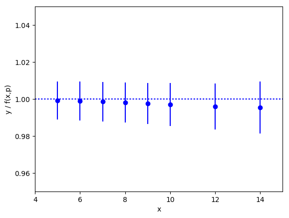
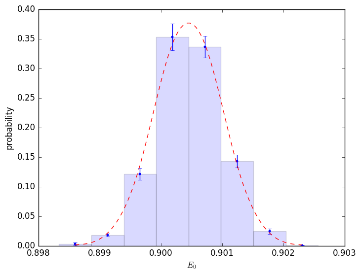

.. |GVar| replace:: :class:`gvar.GVar`
.. |nonlinear_fit| replace:: :class:`lsqfit.nonlinear_fit`
.. |BufferDict| replace:: :class:`gvar.BufferDict`
.. |~| unicode:: U+00A0
   :trim:

Overview and Tutorial
========================

Introduction
--------------------

The  :mod:`lsqfit` module is designed to facilitate least-squares fitting of
noisy data by multi-dimensional, nonlinear functions of arbitrarily many
parameters, each with a (Bayesian) prior.  :mod:`lsqfit` makes heavy use of
another module, :mod:`gvar` (distributed separately), which provides tools
that simplify the analysis of error propagation, and also the creation of
complicated multi-dimensional Gaussian distributions. The power of the
:mod:`gvar` module, particularly for correlated distributions, is a feature
that distinguishes :mod:`lsqfit` from standard fitting packages, as
demonstrated below.

The following (complete) code illustrates basic usage of :mod:`lsqfit`::

   import numpy as np
   import gvar as gv
   import lsqfit

   y = {                      # data for the dependent variable
       'data1' : gv.gvar([1.376, 2.010], [[ 0.0047, 0.01], [ 0.01, 0.056]]),
       'data2' : gv.gvar([1.329, 1.582], [[ 0.0047, 0.0067], [0.0067, 0.0136]]),
       'b/a'   : gv.gvar(2.0, 0.5)
       }
   x = {                      # independent variable
       'data1' : np.array([0.1, 1.0]),
       'data2' : np.array([0.1, 0.5])
       }
   prior = {}
   prior['a'] = gv.gvar(0.5, 0.5)
   prior['b'] = gv.gvar(0.5, 0.5))

   def fcn(x, p):             # fit function of x and parameters p
      ans = {}
      for k in ['data1', 'data2']:
         ans[k] = gv.exp(p['a'] + x[k] * p['b'])
      ans['b/a'] = p['b'] / p['a']
      return ans

   # do the fit
   fit = lsqfit.nonlinear_fit(data=(x, y), prior=prior, fcn=fcn, debug=True)
   print(fit.format(maxline=True))     # print standard summary of fit

   p = fit.p                  # best-fit values for parameters
   outputs = dict(a=p['a'], b=p['b'])
   outputs['b/a'] = p['b']/p['a']
   inputs = dict(y=y, prior=prior)
   print(gv.fmt_values(outputs))              # tabulate outputs
   print(gv.fmt_errorbudget(outputs, inputs)) # print error budget for outputs

This code fits the function ``f(x,a,b)= exp(a+b*x)`` (see ``fcn(x,p)``)
to two sets of data, labeled ``data1`` and ``data2``, by varying parameters
``a`` and ``b`` until ``f(x['data1'],a,b)`` and ``f(x['data2'],a,b)``
equal ``y['data1']`` and ``y['data2']``, respectively, to within the
``y``\s' errors. The means and covariance matrices for the ``y``\s are
specified in the ``gv.gvar(...)``\s used to create them: for example, ::

   >>> print(y['data1'])
   [1.376(69) 2.01(24)]
   >>> print(y['data1'][0].mean, "+-", y['data1'][0].sdev)
   1.376 +- 0.068556546004
   >>> print(gv.evalcov(y['data1']))   # covariance matrix
   [[ 0.0047  0.01  ]
    [ 0.01    0.056 ]]

shows the means, standard deviations and covariance matrix for the data in
the first data set (0.0685565 is the square root of the 0.0047 in
the covariance matrix). The dictionary ``prior`` gives *a priori* estimates
for the two parameters, ``a`` and ``b``: each is assumed to be 0.5±0.5
before fitting. The parameters ``p[k]`` in the fit function ``fcn(x, p)``
are stored in a dictionary having the same keys and layout as
``prior`` (since ``prior`` specifies the fit parameters for
the fitter). In addition, there is an extra piece of input data,
``y['b/a']``, which indicates that ``b/a`` is 2±0.5. The fit
function for this data is simply the ratio ``b/a`` (represented by
``p['b']/p['a']`` in fit function ``fcn(x,p)``). The fit function returns
a dictionary having the same keys and layout as the input data ``y``.

The output from the code sample above is:

.. literalinclude:: eg0.out

The best-fit values for ``a`` and ``b`` are 0.253(32) and
0.449(65), respectively; and the best-fit result for ``b/a`` is
1.78(30), which, because of correlations, is slightly more accurate
than might be expected from the separate errors for ``a`` and ``b``. The
error budget for each of these three quantities is tabulated at the end and
shows that the bulk of the error in each case comes from uncertainties in
the ``y`` data, with only small contributions from uncertainties in the
priors ``prior``. The fit results corresponding to each piece of input data
are also tabulated (``Fit: ...``); the agreement is excellent, as expected
given that the ``chi**2`` per degree of freedom is only 0.17.

Note that the constraint in ``y`` on ``b/a`` in this example is much tighter
than the constraints on ``a`` and ``b`` separately. This suggests a variation
on the previous code, where the tight restriction on ``b/a`` is built into the
prior rather than ``y``::

   ... as before ...

   y = {                      # data for the dependent variable
       'data1' : gv.gvar([1.376, 2.010], [[ 0.0047, 0.01], [ 0.01, 0.056]]),
       'data2' : gv.gvar([1.329, 1.582], [[ 0.0047, 0.0067], [0.0067, 0.0136]])
       }
   x = {                      # independent variable
       'data1' : np.array([0.1, 1.0]),
       'data2' : np.array([0.1, 0.5])
       }
   prior = {}
   prior['a'] = gv.gvar(0.5, 0.5)
   prior['b'] = prior['a'] * gv.gvar(2.0, 0.5)

   def fcn(x, p):             # fit function of x and parameters p[k]
      ans = {}
      for k in ['data1', 'data2']:
         ans[k] = gv.exp(p['a'] + x[k]*p['b'])
      return ans

   ... as before ...

Here the dependent data ``y`` no longer has an entry for ``b/a``, and neither
do results from the fit function; but the prior for ``b`` is now 2±0.5
times the prior for ``a``, thereby introducing a correlation that
limits the ratio ``b/a`` to be 2±0.5 in the fit. This code gives almost
identical results to the first one --- very slightly less accurate, since
there is less input data. We can often move information from the ``y`` data to
the prior or back since both are forms of input information.

There are several things worth noting from this example:

   * The input data (``y``) is expressed in terms of Gaussian random
     variables --- quantities with means and a covariance matrix. These are
     represented by objects of type :class:`gvar.GVar` in the code; module
     :mod:`gvar` has a variety of tools for creating and manipulating
     Gaussian random variables (also see below).

   * The input data is stored in a dictionary (``y``) whose values can
     be |GVar|\s or arrays of |GVar|\s. The use of a dictionary allows for
     far greater flexibility than, say, an array. The fit function
     (``fcn(x, p)``) has to return a dictionary with the same layout as
     that of ``y`` (that is, with the same keys and where the value for
     each key has the same shape as the corresponding value in ``y``).
     :mod:`lsqfit` allows ``y`` to be an array instead of a dictionary,
     which might be preferable for very simple fits (but usually not
     otherwise).

   * The independent data (``x``) can be anything; it is simply passed
     through the fit code to the fit function ``fcn(x,p)``. It can
     also be omitted altogether, in which case the fit function
     depends only upon the parameters: ``fcn(p)``.

   * The fit parameters (``p`` in ``fcn(x,p)``) are also stored in a
     dictionary whose values are |GVar|\s or arrays of |GVar|\s. Again this
     allows for great flexibility. The layout of the parameter dictionary
     is copied from that of the prior (``prior``). Again ``p`` can be a
     single array instead of a dictionary, if that simplifies the code
     (which is usually not the case).

   * The best-fit values of the fit parameters (``fit.p[k]``) are also
     |GVar|\s and these capture statistical correlations between different
     parameters that are indicated by the fit. These output parameters can
     be combined in arithmetic expressions, using standard operators and
     standard functions, to obtain derived quantities. These operations
     take account of and track statistical correlations.

   * Function :func:`gvar.fmt_errorbudget` is a useful tool for assessing
     the origins (``inputs``) of the statistical errors obtained in various
     final results (``outputs``). It is particularly useful for analyzing
     the impact of the *a priori* uncertainties encoded in the prior
     (``prior``).

   * Parameter ``debug=True`` is set in |nonlinear_fit|. This is a good idea,
     particularly in the eary stages of a project, because it causes the
     code to check for various common errors and give more intelligible
     error messages than would otherwise arise. This parameter can be dropped
     once code development is over.

   * The priors for the fit parameters specify Gaussian distributions,
     characterized by the means and standard deviations given
     ``gv.gvar(...)``. Some other distributions become available if argument
     ``extend=True`` is included in the call to |nonlinear_fit|.  The
     distribution for parameter ``a``, for example, can then be switched to a
     log-normal distribution by replacing ``prior['a']=gv.gvar(0.5, 0.5)``
     with::

        prior['log(a)'] = gv.log(gv.gvar(0.5,0.5))

     in the code. This change would
     be desirable if we knew *a priori* that parameter ``a`` is positive
     since this is guaranteed with a log-normal distribution. Only the
     prior need be changed (in particular, the fit function ``fcn(x,p)``
     need *not* be changed).

What follows is a tutorial that demonstrates in greater detail how to
use these modules in some standard variations on the data fitting problem.
As above, code for the examples is specified completely and so can be copied
into a file, and run as is. It can also be modified, allowing for
experimentation.

Another way to learn about the modules is to examine the case studies
that follow this section. Each focuses on a single problem, again with
the full code and data to allow for experimentation.

*About Printing:* The examples in this tutorial use the ``print`` function
as it is used in Python 3. Drop the outermost parenthesis in each ``print``
statement if using Python 2; or add ::

  from __future__ import print_function

at the start of your file.

Gaussian Random Variables and Error Propagation
------------------------------------------------
The inputs and outputs of a nonlinear least squares analysis are probability
distributions, and these distributions will be Gaussian provided the input
data are sufficiently accurate. :mod:`lsqfit` assumes this to be the case.
(It also provides tests for non-Gaussian behavior, together with
methods for dealing with such behavior.)
One of the most distinctive features of :mod:`lsqfit` is that it is
built around a class, |GVar|, of objects that can be used to
represent arbitrarily complicated Gaussian distributions
--- that is, they represent *Gaussian random variables* that specify the means and
covariance matrix of the probability distributions.
The input data for a fit are represented
by a collection of |GVar|\s that specify both the values and possible
errors in the input values. The result of a fit is a collection of
|GVar|\s specifying the best-fit values for the fit parameters and the
estimated uncertainties in those values.

|GVar|\s are defined in the :mod:`gvar` module.
There are four important things to know about them (see the
:mod:`gvar` documentation for more details):

  1)  |GVar|\s are created by :meth:`gvar.gvar`, individually or in
      groups: for example, ::

        >>> import gvar as gv
        >>> print(gv.gvar(1.0, 0.1), gv.gvar('1.0 +- 0.2'), gv.gvar('1.0(4)'))
        1.00(10) 1.00(20) 1.00(40)
        >>> print(gv.gvar([1.0, 1.0, 1.0], [0.1, 0.2, 0.41]))
        [1.00(10) 1.00(20) 1.00(41)]
        >>> print(gv.gvar(['1.0(1)', '1.0(2)', '1.00(41)']))
        [1.00(10) 1.00(20) 1.00(41)]
        >>> print(gv.gvar(dict(a='1.0(1)', b=['1.0(2)', '1.0(4)'])))
        {'a': 1.00(10),'b': array([1.00(20), 1.00(40)], dtype=object)}

      :mod:`gvar` uses the compact notation 1.234(22) to represent
      1.234±0.022 --- the digits in parentheses indicate the
      uncertainty in the rightmost corresponding digits quoted for the
      mean value. Very large (or small) numbers use a notation like
      1.234(22)e10.

  2)  |GVar|\s describe not only means and standard deviations, but also
      statistical correlations between different objects. For example, the
      |GVar|\s created by ::

        >>> import gvar as gv
        >>> a, b = gv.gvar([1, 1], [[0.01, 0.01], [0.01, 0.010001]])
        >>> print(a, b)
        1.00(10) 1.00(10)

      both have means of ``1`` and standard deviations equal to or
      very close to ``0.1``, but the ratio ``b/a`` has a
      standard deviation that is 100x smaller::

        >>> print(b / a)
        1.0000(10)

      This is because the covariance matrix specified for ``a`` and ``b``
      when they were created has large, positive off-diagonal elements::

        >>> print(gv.evalcov([a, b]))         # covariance matrix
        [[ 0.01      0.01    ]
         [ 0.01      0.010001]]

      These off-diagonal elements imply that ``a`` and ``b`` are strongly
      correlated, which means that ``b/a`` or ``b-a`` will have
      much smaller uncertainties than ``a`` or ``b`` separately. The
      correlation coefficient for ``a`` and ``b`` is 0.99995::

        >>> print(gv.evalcorr([a, b]))        # correlation matrix
        [[ 1.       0.99995]
         [ 0.99995  1.     ]]

  3)  |GVar|\s can be used in arithmetic expressions or as arguments
      to pure-Python functions. The results are also |GVar|\s. Covariances
      are propagated through these expressions following the usual rules,
      (automatically) preserving information about correlations. For
      example, the |GVar|\s ``a`` and ``b`` above could have been created
      using the following code::

        >>> a = gv.gvar(1, 0.1)
        >>> b = a + gv.gvar(0, 0.001)
        >>> print(a, b)
        1.00(10) 1.00(10)
        >>> print(b / a)
        1.0000(10)
        >>> print(gv.evalcov([a, b]))
        [[ 0.01      0.01    ]
         [ 0.01      0.010001]]

      The correlation is obvious from this code: ``b`` is equal to ``a``
      plus a very small correction. From these variables we can
      create new variables that are also highly correlated::

        >>> x = gv.log(1 + a ** 2)
        >>> y = b * gv.cosh(a / 2)
        >>> print(x, y, y / x)
        0.69(10) 1.13(14) 1.627(34)
        >>> print gv.evalcov([x, y])
        [[ 0.01        0.01388174]
         [ 0.01388174  0.01927153]]

      The :mod:`gvar` module defines versions of the standard Python
      functions (``sin``, ``cos``, ...) that work with |GVar|\s. Most any
      numeric pure-Python function will work with them as well. Numeric
      functions that are compiled in C or other low-level languages
      generally do not work with |GVar|\s; they should be replaced by
      equivalent pure-Python functions if they are needed for |GVar|-valued
      arguments. See the :mod:`gvar` documentation for more
      information.

      The fact that correlation information is preserved *automatically*
      through arbitrarily complicated arithmetic is what makes
      |GVar|\s particularly useful. This is accomplished using *automatic
      differentiation* to compute the derivatives of any *derived* |GVar|
      with respect to the *primary* |GVar|\s (those defined using
      :func:`gvar.gvar`) from which it was created. As a result, for example,
      we need not provide derivatives of fit functions for :mod:`lsqfit`
      (which are needed for the fit) since they are computed implicitly
      by the fitter from the fit function itself. Also
      it becomes trivial to build correlations into the priors used
      in fits, and to analyze the propagation of errors through
      complicated functions of the parameters after the fit.

  4)  Storing |GVar|\s in a file for later use is somewhat complicated
      because one generally wants to hold onto their correlations as well
      as their mean values and standard deviations. One easy way to do
      this is to put all of the |GVar|\s to be saved into a single
      dictionary object of type |BufferDict|, and then to save the
      |BufferDict| using Python's :mod:`pickle` module: for example,
      using the variables defined above, ::

        >>> import pickle
        >>> buffer = gv.BufferDict(a=a, b=b, x=x, y=y)
        >>> print(buffer)
        {'a': 1.00(10),'b': 1.00(10),'x': 0.69(10),'y': 1.13(14)}
        >>> pickle.dump(buffer, open('outputfile.p', 'wb'))

      This creates a file named ``'outputfile.p'`` containing the |GVar|\s.
      Loading the file into a Python code later recovers the |BufferDict|
      with correlations intact::

        >>> buffer = pickle.load(open('outputfile.p', 'rb'))
        >>> print(buffer)
        {'a': 1.00(10),'b': 1.00(10),'x': 0.69(10),'y': 1.13(14)}
        >>> print(buffer['y'] / buffer['x'])
        1.627(34)

      |BufferDict|\s were created specifically to handle |GVar|\s,
      although they can be quite useful with other data types as well.
      The values in a pickled |BufferDict| can be individual |GVar|\s or
      arbitrary :mod:`numpy` arrays of |GVar|\s. See the :mod:`gvar`
      docmentation for more information.

There is considerably more information about |GVar|\s in the documentation for
module :mod:`gvar`.

.. _basic-fits:

Basic Fits
----------
A fit analysis typically requires three types of input: 1) fit data
``x,y`` (or possibly just ``y``); 2) a function ``y = f(x, p)`` relating
values of ``y`` to to values of ``x`` and a set of fit parameters ``p``
(if there is no ``x``, then ``y = f(p)``);
and 3) some *a priori* idea about the fit parameters' values. The *a priori*
information about a parameter could be fairly imprecise --- for example,
the parameter is order 1. The point of
the fit is to improve our knowledge of the parameter values, beyond
our *a priori* impressions, by analyzing the fit data. We now show how
to do this using the :mod:`lsqfit` module.

For this example, we use
fake data generated by a function, ``make_data()``, that is described
at the end of this section. The function call ``x,y = make_data()``
generates 11 values for ``x``, equal to ``5,6,7..10,12,14..20``,
and 11 values for ``y``, where each ``y`` is obtained by adding
random noise to the value
of a function of the corresponding ``x``. The function of ``x`` we use is::

    sum(a[i] * exp(-E[i]*x)  for i in range(100))

where ``a[i]=0.4`` and ``E[i]=0.9*(i+1)``.
The result is a set of random ``y``\s with correlated statistical errors::

   >>> print(y)
   [0.004502(46) 0.001817(19) 0.0007362(79) ... ]

   >>> print(gv.evalcov(y))              # covariance matrix
   [[  2.15378088e-09   8.81617947e-10   3.62373566e-10 ... ]
    [  8.81617947e-10   3.61934618e-10   1.49216108e-10 ... ]
    [  3.62373566e-10   1.49216108e-10   6.17104688e-11 ... ]
    ...
   ]

Our goal is to fit this data for ``y``, as a function of ``x``,
and obtain estimates for the parameters ``a[i]`` and ``E[i]``. The
correct results are, of course, ``a[i]=0.4`` and ``E[i]=0.9*(i+1)``
but we will pretend that we do not know this.

Next we need code for the fit function. We assume that we know
that a sum of exponentials is appropriate, and therefore we define the following
Python function to represent the relationship between ``x`` and ``y`` in
our fit::

   import numpy as np

   def f(x, p):         # function used to fit x, y data
       a = p['a']       # array of a[i]s
       E = p['E']       # array of E[i]s
       return sum(ai * np.exp(-Ei * x) for ai, Ei in zip(a, E))

The fit parameters, ``a[i]`` and ``E[i]``, are stored in a
dictionary, using labels ``a`` and ``E`` to access them. These parameters
are varied in the fit to find the best-fit values ``p=p_fit`` for which
``f(x, p_fit)`` most closely approximates the ``y``\s in our fit data. The
number of exponentials included in the sum is specified implicitly in this
function, by the lengths of the ``p['a']`` and ``p['E']`` arrays.

Finally we need to define priors that encapsulate our *a priori* knowledge
about the fit-parameter values. In practice we almost always have *a priori*
knowledge about parameters; it is usually impossible to design a fit
function without some sense of the parameter sizes. Given such knowledge
it is important (usually essential) to include it in the fit. This is
done by designing priors for the fit, which are probability distributions
for each parameter that describe the *a priori* uncertainty in that
parameter. As discussed in the previous section, we use objects of type
:class:`gvar.GVar` to describe (Gaussian) probability distributions.
Let's assume that before the fit we suspect that each ``a[i]`` is of order
0.5±0.4, while ``E[i]`` is of order (1+i)±0.4. A prior
that represents this information is built using the following code::

   import lsqfit
   import gvar as gv

   def make_prior(nexp):               # make priors for fit parameters
       prior = gv.BufferDict()         # prior -- any dictionary works
       prior['a'] = [gv.gvar(0.5, 0.4) for i in range(nexp)]
       prior['E'] = [gv.gvar(i+1, 0.4) for i in range(nexp)]
       return prior

where ``nexp`` is the number of exponential terms that will be used (and
therefore the number of ``a``\s and ``E``\s). With ``nexp=3``, for example,
one would then have::

   >>> print(prior['a'])
   [0.50(40) 0.50(40) 0.50(40)]
   >>> print(prior['E'])
   [1.00(40), 2.00(40), 3.00(40)]

We use dictionary-like class :class:`gvar.BufferDict` for the prior because it
allows us to save the prior in a file if we wish (using Python's :mod:`pickle`
module).
If saving is unnecessary, :class:`gvar.BufferDict` can be replaced by
``dict()`` or most any other Python dictionary class.

With fit data, a fit function, and a prior for the fit parameters, we are
finally ready to do the fit, which is now easy::

  fit = lsqfit.nonlinear_fit(data=(x, y), fcn=f, prior=prior)

So pulling together the entire code,
our complete Python program for making fake data and fitting it is::

   import lsqfit
   import numpy as np
   import gvar as gv

   def f_exact(x, nexp=100):          # exact f(x)
       return sum(0.4 * np.exp(-0.9*(i+1) * x) for i in range(nexp))

   def f(x, p):                        # function used to fit x, y data
       a = p['a']                      # array of a[i]s
       E = p['E']                      # array of E[i]s
       return sum(ai * np.exp(-Ei * x) for ai, Ei in zip(a, E))

   def make_data(nexp=100, eps=0.01): # make x, y fit data
       x = np.array([5., 6., 7., 8., 9., 10., 12., 14., 16., 18., 20.])
       cr = gv.gvar(0.0, eps)
       c = [gv.gvar(cr(), eps) for n in range(100)]
       x_xmax = x/max(x)
       noise = 1+ sum(c[n] * x_xmax ** n for n in range(100))
       y = f_exact(x, nexp) * noise
       return x, y

   def make_prior(nexp):               # make priors for fit parameters
       prior = gv.BufferDict()         # prior -- any dictionary works
       prior['a'] = [gv.gvar(0.5, 0.4) for i in range(nexp)]
       prior['E'] = [gv.gvar(i+1, 0.4) for i in range(nexp)]
       return prior

   def main():
       gv.ranseed([2009, 2010, 2011, 2012]) # initialize random numbers (opt.)
       x, y = make_data()              # make fit data
       p0 = None                       # make larger fits go faster (opt.)
       for nexp in range(1, 11):
           print('************************************* nexp =', nexp)
           prior = make_prior(nexp)
           fit = lsqfit.nonlinear_fit(data=(x, y), fcn=f, prior=prior, p0=p0)
           print(fit)                  # print the fit results
           if nexp > 2:
               E = fit.p['E']          # best-fit parameters
               a = fit.p['a']
               print('E1/E0 =', E[1] / E[0], '  E2/E0 =', E[2] / E[0])
               print('a1/a0 =', a[1] / a[0], '  a2/a0 =', a[2] / a[0])
           if fit.chi2 / fit.dof < 1.:
               p0 = fit.pmean          # starting point for next fit (opt.)
           print()

   if __name__ == '__main__':
       main()

We are not sure *a priori* how many exponentials are needed to fit our
data. Given that there are only eleven ``y``\s, and these are noisy, there
may only be information in the data about the first few terms. Consequently
we write our code to try fitting with each of ``nexp=1,2,3..10`` terms.
(The pieces of the code involving ``p0`` are optional; they make the
more complicated fits go about 30 times faster since the output from one
fit is used as the starting point for the next fit --- see the discussion
of the ``p0`` parameter for :class:`lsqfit.nonlinear_fit`.) Running
this code produces the following output, which is reproduced here in some
detail in order to illustrate a variety of features:

.. literalinclude:: eg1.out

There are several things to notice here:

   * Clearly two exponentials (``nexp=2``) is not enough. The ``chi**2``
     per degree of freedom (``chi2/dof``) is significantly larger than one.
     The
     ``chi**2`` improves substantially for ``nexp=3`` exponentials,
     and there is
     essentially no change when further exponentials are added.

   * The best-fit values for each parameter are listed for each of the
     fits, together with the prior values (in brackets, on the right).
     Values for each ``a[i]`` and ``E[i]`` are listed in order, starting at
     the points indicated by the labels ``a`` and ``E``. Asterisks are
     printed at the end of the line if the mean best-fit value differs from
     the prior's mean by more than one standard deviation; the number
     of asterisks, up to a maximum of 5, indicates how many standard
     deviations the difference is. Differences of one or two standard
     deviations are not uncommon; larger differences could indicate a
     problem with the prior or the fit.

     Once the fit converges, the best-fit values for the various parameters
     agree well --- that is to within their errors, approximately --- with
     the exact values, which we know since we are using fake data. For
     example, ``a`` and ``E`` for the first exponential are 0.402(4)
     and 0.9004(5), respectively, from the fit where the exact answers
     are 0.4 and 0.9; and we get 0.411(9) and 1.806(5) for
     the second exponential where the exact values are 0.4 and 1.8.

   * Note in the ``nexp=4`` fit how the means and standard deviations for
     the parameters governing the fourth (and last) exponential are essentially
     identical to the values in the corresponding priors: 0.50(40) from
     the fit for ``a`` and 4.0(4) for ``E``. This tells us that our fit
     data has no information to add to what we knew *a priori*
     about these parameters --- there isn't enough data and what we have
     isn't accurate enough.

     This situation remains true of further terms as they are added in
     the ``nexp=5`` and later fits. This is why the fit results stop
     changing once we have ``nexp=3`` exponentials. There is no point in
     including further exponentials, beyond the need to verify that the fit
     has indeed converged.

   * The last fit includes ``nexp=10`` exponentials and therefore has 20
     parameters. This is in a fit to 11 ``y``\s. Old-fashioned fits, without
     priors, are impossible when the number of parameters exceeds the number
     of data points. That is clearly not the case here, where the number of
     terms and parameters can be made arbitrarily large, eventually (after
     ``nexp=3`` terms) with no effect at all on the results.

     The reason is that the prior that we include for each new parameter
     is, in effect, a new piece of data (the mean and standard deviation of
     the *a priori* expectation for that parameter); it leads to a new term
     in the ``chi**2`` function. We are fitting both the data and our *a
     priori* expectations for the parameters. So in the ``nexp=10`` fit,
     for example, we actually have 31 pieces of data to fit: the 11 ``y``\s
     plus the 20 prior values for the 20 parameters.

     The effective number of degrees of freedom (``dof`` in the output
     above) is the number of pieces of data minus the number of fit
     parameters, or 31-20=11 in this last case. With priors for every
     parameter, the number of degrees of freedom is always equal to the
     number of ``y``\s, irrespective of how many fit parameters there are.

   * The Gaussian Bayes Factor (whose logarithm is
     ``logGBF`` in the output) is a measure of the likelihood that the actual
     data being fit could have come from a theory with the prior and
     fit function used in the
     fit. The larger this number, the more likely it is that prior/fit-function
     and data
     could be related. Here it grows dramatically from the first fit
     (``nexp=1``) but then stops changing after ``nexp=3``. The
     implication is that this data is much more likely to have come from a
     theory with ``nexp>=3`` than with ``nexp=1`` (which we know to be the
     actual case).

   * In the code, results for each fit are captured in a Python object
     ``fit``, which is of type :class:`lsqfit.nonlinear_fit`. A summary of the
     fit information is obtained by printing ``fit``. Also the best-fit
     results for each fit parameter can be accessed through ``fit.p``, as is
     done here to calculate various ratios of parameters.

     The errors in these last calculations automatically account for any
     correlations in the statistical errors for different parameters. This
     is evident in the ratio ``a1/a0``, which would be 1.022(25) if
     there was no statistical correlation between our estimates for ``a1``
     and ``a0``, but in fact is 1.022(20) in this fit. The modest (positive)
     correlation is clear from the correlation matrix::

      >>> print(gv.evalcorr(a[:2]))
      [[ 1.          0.48404447]
       [ 0.48404447  1.        ]]

Finally we inspect the fit's quality point by point. The input data are
compared with results from the fit function, evaluated with the best-fit
parameters, in the following table (obtained in the code by printing the
output from ``fit.format(maxline=True)``\)::

  Fit:
       x[k]               y[k]          f(x[k],p)
  -----------------------------------------------
          5      0.004502 (46)      0.004505 (46)
          6      0.001817 (19)      0.001819 (19)
          7     0.0007362 (79)     0.0007371 (78)
          8     0.0002987 (33)     0.0002992 (32)
          9     0.0001213 (14)     0.0001216 (13)
         10    0.00004926 (57)    0.00004939 (56)
         12       8.13(10)e-06      8.156(96)e-06
         14      1.342(19)e-06      1.347(17)e-06
         16      2.217(37)e-07      2.224(29)e-07
         18      3.661(85)e-08      3.674(50)e-08
         20       6.24(61)e-09      6.067(88)e-09

The fit is excellent over the entire six orders of magnitude. This
information is presented again in the following plot, which shows the ratio
``y/f(x,p)``, as a function of ``x``, using the best-fit parameters ``p``.
The correct result for this ratio, of course, is one. The smooth variation
in the data --- smooth compared with the size of the statistical-error bars
--- is an indication of the statistical correlations between individual
``y``\s.

This particular plot was made using the :mod:`matplotlib` module, with the
following code added to the end of ``main()`` (outside the loop)::

      import matplotlib.pyplot as plt
      ratio = y / f(x, fit.pmean)
      plt.xlim(4, 21)
      plt.xlabel('x')
      plt.ylabel('y / f(x,p)')
      plt.errorbar(x=x, y=gv.mean(ratio), yerr=gv.sdev(ratio), fmt='ob')
      plt.plot([4.0, 21.0], [1.0, 1.0], 'b:')
      plt.show()

**Making Fake Data:** Function ``make_data()`` creates a list of ``x`` values,
evaluates the underlying function, ``f_exact(x)``, for those values,
and then adds random noise to the results to create the ``y`` array
of fit data: ``y = f_exact(x) * noise`` where ::

      noise = 1 + sum_n=0..99 c[n] * (x/x_max) ** n

Here the ``c[n]`` are random coefficients generated using the following code::

       cr = gv.gvar(0.0, eps)
       c = [gv.gvar(cr(), eps) for n in range(100)]

Gaussian variable ``cr`` represents a Gaussian distribution with mean
0.0 and width 0.01, which we use here as a random number generator:
``cr()`` is a number drawn randomly from the distribution represented by
``cr``::

   >>> print(cr)
   0.000(10)
   >>> print(cr())
   0.00452180208286
   >>> print(cr())
   -0.00731564589737

We use ``cr()`` to generate mean values for the Gaussian distributions
represented by the ``c[n]``\s, each of which has width 0.01. The resulting
``y``\s fluctuate around the corresponding values of ``f_exact(x)``::

   >>> print(y-f_exact(x))
   [0.0011(27) 0.00029(80) ... ]

The Gaussian variables ``y[i]`` together with the numbers ``x[i]`` comprise
our fake data.

Chained Fits
-------------
The priors in a fit represent knowledge that we have about the parameters
before we do the fit. This knowledge might come from theoretical considerations
or experiment. Or it might come from another fit. Imagine that we want to add
new information to that extracted from the fit in the previous section.
For example, we might learn from some other source that the ratio of
amplitudes ``a[1]/a[0]`` equals 1±1e-5. The challenge is to combine
this new information with information extracted from the fit above without rerunning
that fit. (We assume it is not possible to rerun the first fit, because, say,
the input data for that fit has been lost or is unavailable.)

We can combine the new data with the old fit results by creating a new
fit using the best-fit parameters, ``fit.p``, from the old fit as the
priors for the new fit. To try this out, we add the following code
onto the end of the ``main()`` subroutine in the previous section,
keeping ``nexp<=4`` (since that is all that is needed)::

  def ratio(p):                       # new fit function
      a = p['a']
      return a[1] / a[0]

  prior = fit.p                       # prior = best-fit parameters from 1st fit
  data = gv.gvar(1, 1e-5)             # new data for the ratio

  newfit = lsqfit.nonlinear_fit(data=data, fcn=ratio, prior=prior)
  print(newfit)
  E = newfit.p['E']
  a = newfit.p['a']
  print('E1/E0 =', E[1] / E[0], '  E2/E0 =', E[2] / E[0])
  print('a1/a0 =', a[1] / a[0], '  a2/a0 =', a[2] / a[0])

The result of the new fit (to one piece of new data) is:

.. literalinclude:: eg1a.out

Parameters ``a[0]`` and ``E[0]`` are essentially unchanged by the new
information, but ``a[i]`` and ``E[i]`` are more precise for ``i=1`` and ``2``,
as is ``a[1]/a[0]``, of course.

It might seem odd that ``E[1]``, for example, is changed at
all, since the fit function, ``ratio(p)``, makes no mention of it. This
is not surprising, however, since ``ratio(p)`` does depend upon ``a[1]``,
and ``a[1]`` is strongly correlated with ``E[1]`` through the prior. It
is important to include all parameters from the first fit as
parameters in the new fit in order to capture the impact of the new
information on parameters correlated with ``a[1]/a[0]``.

It would have been easy to change the fit code in the previous section to
incorporate the new information about ``a[1]/a[0]``. The approach presented
here is numerically equivalent to that approach
insofar as the ``chi**2`` function for the
original fit can be well approximated by a quadratic function
in the fit parameters.
This is, of course, a fundamental assumption underlying the
use of :mod:`lsqfit` in the first place.

Obviously, we can include further fits in order to incorporate more data. The
prior for each new fit is the best-fit output (``fit.p``) from the previous
fit. The output from the chain's final fit is the cummulative  result of all
of these fits.

Finally note that this particular problem can be done much more
simply using a weighted average (:func:`lsqfit.wavg`).
Adding the following code
onto the end of the ``main()`` subroutine in the previous section ::

    fit.p['a1/a0'] = fit.p['a'][1] / fit.p['a'][0]
    new_data = {'a1/a0' : gv.gvar(1,1e-5)}
    new_p = lsqfit.wavg([fit.p, new_data])

    print('chi2/dof = %.2f\n' % new_p.chi2 / new_p.dof)
    print('E:', new_p['E'][:4])
    print('a:', new_p['a'][:4])
    print('a1/a0:', new_p['a1/a0'])

gives the following output:

.. literalinclude:: eg1b.out

Here we do a weighted average of ``a[1]/a[0]`` from the
original fit (``fit.p['a1/a0']``) with our new piece of data
(``new_data['a1/a0']``). The dictionary ``new_p`` returned by
:func:`lsqfit.wavg` has an entry for
every key in either ``fit.p`` or ``new_data``. The weighted average for
``a[1]/a[0]`` is in ``new_data['a1/a0']``. New values for the
fit parameters, that take account of the new data, are stored in
``new_p['E']`` and ``new_p['a']``. The ``E[i]`` and ``a[i]``
estimates differ from their values in ``fit.p`` since those parameters
are correlated with ``a[1]/a[0]``. Consequently when the ratio
is shifted by new data, the  ``E[i]`` and ``a[i]`` are shifted as well.
The final results in ``new_p``
are almost identical to what we obtained above; this is because
the errors are sufficiently small
that the ratio ``a[1]/a[0]`` is Gaussian.

Bayesian Integrals
-------------------
The least-squares fit analyses above implicitly assume that every probability
distribution relevant to the fits is well approximated by a Gaussian
distribution. The key distribution in a fit is the probability density function
for
the parameters, which is proportional to ``exp(-chi**2/2)`` in
a full Bayesian analysis. (Here the the ``chi**2`` function
is treated as a function of the parameters
and has contributions from both the data and the priors.) Bayesian estimates
for the fit parameters are the
expectation values of those parameters
calculated with this probability density function. These will agree with the
best-fit results of our least-squares fits provided ``chi**2`` is well
approximated by its quadratic expansion in the parameters --- that is,
insofar as
``exp(-chi**2/2)`` is well approximated
by the Gaussian distribution in the parameters
specified by their best-fit means and covariance matrix (in ``fit.p``).
:class:`lsqfit.BayesIntegrator` can be used to evaluate Bayesian
expectation values when the Gaussian approximation breaks down.

:class:`lsqfit.BayesIntegrator` uses the :mod:`vegas` module for adaptive
multi-dimensional integration to evaluate expectation values by integrating
arbitrary functions of the parameters, mutliplied by the exact probability
density function, over the entire parameter space. (Module :mod:`vegas`
must be installed for :class:`lsqfit.BayesIntegrator`.) To illustrate its
use we will redo the fit in our discussion of :ref:`basic-fits` using
Bayesian integration. To keep things simple we will focus just
on the parameters
``a[0]`` and ``E[0]`` that describe the leading exponential.

The following code, added to the end of the ``main()`` function
in :ref:`basic-fits` (outside the loop),
evaluates the Bayesian expectation value
of function ``g(p)`` of the fit parameters::

        # fit is from the last least-squares fit
        expval = lsqfit.BayesIntegrator(fit, limit=10.)

        # adapt integrator to PDF from fit
        expval(neval=10000, nitn=10)

        # calculate expectation value of function g(p)
        E0_hist = gv.PDFHistogram(fit.p['E'][0])

        def g(p):
            parameters = [p['a'][0], p['E'][0]]
            return dict(
                mean=parameters,
                outer=np.outer(parameters, parameters),
                hist=E0_hist.count(p['E'][0]),
                )

        results = expval(g, neval=10000, nitn=10, adapt=False)

        # analyze results and compare with least-squares fit results
        print(results.summary())
        mean = results['mean']
        cov = results['outer'] - np.outer(results['mean'], results['mean'])

        print('Results from Bayesian Integration:')
        print('a0: mean =', mean[0], '  sdev =', cov[0,0]**0.5)
        print('E0: mean =', mean[1], '  sdev =', cov[1,1]**0.5)
        print(
            'covariance from Bayesian integral =',
            np.array2string(cov, prefix=36 * ' ')
            )
        print()

        print('Results from Least-Squares Fit:')
        print('a0: mean =', fit.p['a'][0].mean, '  sdev =', fit.p['a'][0].sdev)
        print('E0: mean =', fit.p['E'][0].mean, '  sdev =', fit.p['E'][0].sdev)
        print(
            'covariance from least-squares fit =',
            np.array2string(
                gv.evalcov([fit.p['a'][0], fit.p['E'][0]]),
                prefix=36 * ' ', precision=3
                )
            )

        # make histogram of E[0] probabilty
        plt = E0_hist.make_plot(results['hist'])
        plt.xlabel('$E_0$')
        plt.show()

Here ``expval`` is an integrator that is used to evaluate expectation
values of arbitrary functions of the fit parameters.
:class:`BayesIntegrator` uses output (``fit``) from a least-squares fit to
design a :mod:`vegas` integrator for calculating expectation values.
The integrator uses an
iterative Monte Carlo algorithm that adapts to the
probability density function after each iteration.
See the :mod:`vegas` documentation for much more information.

We first call the integrator without a function. This allows it
to adapt to the probability density function from the fit without the extra
overhead of evaluating some function of the parameters. The integrator
uses ``nitn=10`` iterations of the :mod:`vegas` algorithm, with at most
``neval=10000`` evaluations of the probability density function for each
iteration.

We then use the optimized integrator to evaluate the expectation value
of function ``g(p)`` (turning adaptation off with ``adapt=False``).
The expectation value of ``g(p)`` is returned
in dictionary ``results``, where ``results[k]`` is the expectation value
of ``g(p)[k]`` for each key used in the dictionary returned by ``g(p)``.
Thus ``results[mean]``, for example, contains the expectation value
of ``[a[0], E[0]]`` (*i.e.*, the mean value). We also compute the
expectation value of outer product of ``[a[0], E[0]]`` with itself, so we
can compute the covariance matrix for ``a[0]`` and ``E[0]``. Finally
we accumulate histogram data, using :class:`PDFHistogram` from the
:mod:`gvar` module, for ``E[0]``.

The output from this codes is (for ``nexp=4``):

.. literalinclude:: eg1c.out

The table shows results from each of the ``nitn=10`` :mod:`vegas`
iterations used to evaluate the expectation values. Estimates
for the integral of the probability density function are listed
for each iteration. (Results from the integrator are approximate,
with error estimates.) These are consistent with each other and with
the (more accurate) overall average. The table shows that the
probability density function is normalized to 0.258(11) rather than
to unity. This indicates that the distribution is not quite Gaussian,
although 0.258 is fairly close to 1 for an 8-dimensional distribution
(the 1/8-th root of 0.258 is 0.84).

The agreement is excellent between the mean values and covariances
calculated using Bayesian integrals, and those directly from the
least-squares fit. This suggests that the Gaussian approximation is
reliable for this problem. The Bayesian integral, over all 8 parameters,
takes much more time (15--20 seconds on a 2014 laptop) than the least-squares
fit (a small fraction of a second), so the latter is much more efficient when
the Gaussian approximation is sufficiently accurate.

As a further check on the Gaussian approximation we also accumulated data
(``results['hist']``) on the probability distribution of ``E[0]`` values,
integrating out the other 7 parameters. The plot produced by the code
above shows that posterior probability distribution for ``E[0]`` (bars)
agrees well with that implied by ``fit.p['E'][0]`` (dashed line):

The Bayesian integrals are relatively simple in this example. More
complicated problems can require much more computer time to evaluate
the integrals, with hundreds of thousands or millions of integrand
evaluations per iteration (``neval``). This is particularly true
as the number of parameters increases. :class:`BayesIntegrator` uses
information from the least-squares fit to simplify the integration
for :mod:`vegas` by optimizing the integration variables used, but
integrals over tens of variables are intrinsically challenging.
:class:`BayesIntegrator` can be used with MPI to run such integrals
on multiple processors, for a considerable speed-up.

``x`` has Error Bars
--------------------
We now consider variations on our basic fit analysis (described in
:ref:`basic-fits`).
The first variation concerns what to do when the independent variables, the
``x``\s, have errors, as well as the ``y``\s. This is easily handled by
turning the ``x``\s into fit parameters, and otherwise dispensing
with independent variables.

To illustrate this, we modify the basic analysis code above.
First we need to add errors to the ``x``\s, which we do by
changing ``make_data`` so that each ``x`` has a random value within about
±0.001% of its original value and an error::

   def make_data(nexp=100, eps=0.01): # make x, y fit data
       x = np.array([5., 6., 7., 8., 9., 10., 12., 14., 16., 18., 20.])
       cr = gv.gvar(0.0, eps)
       c = [gv.gvar(cr(), eps) for n in range(100)]
       x_xmax = x/max(x)
       noise = 1+ sum(c[n] * x_xmax ** n for n in range(100))
       y = f_exact(x, nexp) * noise            # noisy y[i]s
       xfac = gv.gvar(1.0, 0.00001)    # Gaussian distrib'n: 1±0.001%
       x = np.array([xi * gv.gvar(xfac(), xfac.sdev) for xi in x]) # noisy x[i]s
       return x, y

Here :class:`gvar.GVar` object ``xfac`` is used as a random number
generator: each time it is called, ``xfac()`` is a different random number
from the distribution with mean ``xfac.mean`` and standard deviation
``xfac.sdev`` (that is, 1±0.00001). The main program is modified so
that the (now random) ``x`` array is treated as a fit parameter. The prior
for each ``x`` is, obviously, specified by the mean and standard deviation
of that ``x``, which is read directly out of the array of ``x``\s produced
by ``make_data()``::

   def make_prior(nexp, x):            # make priors for fit parameters
       prior = gv.BufferDict()         # prior -- any dictionary works
       prior['a'] = [gv.gvar(0.5, 0.5) for i in range(nexp)]
       prior['E'] = [gv.gvar(i+1, 0.5) for i in range(nexp)]
       prior['x'] = x                  # x now an array of parameters
       return prior

   def main():
       gv.ranseed([2009, 2010, 2011, 2012]) # initialize random numbers (opt.)
       x, y = make_data()              # make fit data
       p0 = None                       # make larger fits go faster (opt.)
       for nexp in range(1, 10):
           print('************************************* nexp =', nexp)
           prior = make_prior(nexp, x)
           fit = lsqfit.nonlinear_fit(data=y, fcn=f, prior=prior, p0=p0)
           print(fit)                  # print the fit results
           if nexp > 2:
               E = fit.p['E']              # best-fit parameters
               a = fit.p['a']
               print('E1/E0 =', E[1] / E[0], '  E2/E0 =', E[2] / E[0])
               print('a1/a0 =', a[1] / a[0], '  a2/a0 =', a[2] / a[0])
           if fit.chi2/fit.dof<1.:
               p0 = fit.pmean          # starting point for next fit (opt.)
           print()

The fit data now consists of just the ``y`` array (``data=y``), and the
fit function loses its ``x`` argument and gets its ``x`` values from the
fit parameters ``p`` instead::

   def f(p):
       a = p['a']
       E = p['E']
       x = p['x']
       return sum(ai*exp(-Ei*x) for ai, Ei in zip(a, E))

Running the new code gives, for ``nexp=4`` terms:

.. literalinclude:: eg2.out

This looks quite a bit like what we obtained before, except that now there
are 11 more parameters, one for each ``x``, and also now all results are
a good deal less accurate. Note that one result from this analysis is new
values for the ``x``\s. In some cases (*e.g.*,  ``x[4]`` and ``x[5]``),
the errors on the ``x`` values have been
reduced --- by information in the fit data.

.. _correlated-parameters:

Correlated Parameters; Gaussian Bayes Factor
---------------------------------------------
:class:`gvar.GVar` objects are very useful for handling more complicated
priors, including situations where we know *a priori* of correlations
between parameters. Returning to the :ref:`basic-fits` example above,
imagine a situation where we still have a ±0.4 uncertainty about the
value of any individual ``E[i]``, but we know *a priori* that the
separations between adjacent ``E[i]``\s is 0.9±0.01. We want to
build the correlation between adjacent ``E[i]``\s into our prior.

We do this by introducing a :class:`gvar.GVar` object ``de[i]`` for each
separate difference ``E[i]-E[i-1]``, with ``de[0]`` being ``E[0]``::

   de = [gvar(0.9, 0.01) for i in range(nexp)]
   de[0] = gvar(1, 0.5)    # different distribution for E[0]

Then ``de[0]`` specifies the probability distribution for ``E[0]``,
``de[0]+de[1]`` the distribution for ``E[1]``, ``de[0]+de[1]+de[2]`` the
distribution for ``E[2]``, and so on. This can be implemented (slightly
inefficiently) in a single line of Python::

   E = [sum(de[:i+1]) for i in range(nexp)]

For ``nexp=3``, this implies that ::

   >>> print(E)
   [1.00(40) 1.90(40) 2.80(40)]
   >>> print(E[1] - E[0], E[2] - E[1])
   0.900(10) 0.900(10)

which shows that each ``E[i]`` separately has an uncertainty of ±0.4
(approximately) but that differences are specified to within ±0.01.

In the code, we need only change the definition of the prior in order to
introduce these correlations::

   def make_prior(nexp):               # make priors for fit parameters
       prior = gv.BufferDict()         # prior -- any dictionary works
       prior['a'] = [gv.gvar(0.5, 0.4) for i in range(nexp)]
       de = [gv.gvar(0.9, 0.01) for i in range(nexp)]
       de[0] = gv.gvar(1, 0.4)
       prior['E'] = [sum(de[:i + 1]) for i in range(nexp)]
       return prior

Running the code as before, but now with the correlated prior in place, we
obtain the following fit with ``nexp=5`` terms:

.. literalinclude:: eg3.out

The results are similar to before for the leading parameters, but
substantially more accurate for parameters describing the second and later
exponential terms, as might be expected given our enhanced knowledge about
the differences between ``E[i]``\s. The output energy differences are
particularly accurate: they range from ``E[1]-E[0] = 0.9025(39)``, which is
almost three times more precise than the prior, to ``E[6]-E[5] = 0.900(10)``,
which
is just what was put into the fit through the prior (the fit data adds no
new information). The correlated prior allows us to merge our *a priori*
information about the energy differences with the new information carried
by the fit data ``x, y``.

Note that the Gaussian Bayes Factor (see ``logGBF`` in the output) is
larger with the correlated prior (``logGBF = 186.5``) than it
was for the uncorrelated prior (``logGBF = 182.4``). Had we been
uncertain as to which prior was more appropriate, this difference says that
the data prefers the correlated prior. (More precisely, it says that we
would be ``exp(186.5-182.4) = 60`` times more likely to get our ``x,y`` data
from a theory with the
correlated prior than from one with the uncorrelated prior.) This
difference is significant despite the fact that the ``chi**2``\s in the two
cases are almost the same. ``chi**2`` tests goodness of fit, but there are
usually more ways than one to get a good fit. Some are more plausible
than others, and the Bayes factor helps sort out which.

The Gaussian Bayes Factor is an approximation to
the *Bayes Factor* which is valid in the limit where
all distributions can be approximated by Gaussians. The Bayes Factor
is the probability
(density) that the fit data would be generated randomly from the
fit function and priors (the *model*) used in the fit.
Ratios of Bayes Factors from fits with different models tell us about the
relative likelihood of the different models given the data. (Actually the
ratio gives the ratio of probabilities for obtaining the data
from the models, as opposed to the probabilities for the models given
the data. The latter ratio is the same as the former, however, provided
the two models are equally likely *a priori* (from Bayes Theorem).)

.. _empirical-bayes:

Tuning Priors and the Empirical Bayes Criterion
------------------------------------------------
Given two choices of prior for a parameter, the one that results in a larger
Gaussian Bayes Factor after fitting (see ``logGBF`` in fit output or
``fit.logGBF``) is the one preferred by the data. We can use this fact to tune
a prior or set of priors in situations where we are uncertain about the
correct *a priori* value: we vary the widths and/or central values of the
priors of interest to maximize ``logGBF``. This leads to complete nonsense if
it is applied to all the priors, but it is useful for tuning (or testing)
limited subsets of the priors when other information is unavailable. In effect
we are using the data to get a feel for what is a reasonable prior. This
procedure for setting priors is called the *Empirical Bayes* method.

This method is implemented in a driver program ::

    fit, z = lsqfit.empbayes_fit(z0, fitargs)

which varies :mod:`numpy` array ``z``, starting at ``z0``, to maximize
``fit.logGBF`` where ::

    fit = lsqfit.nonlinear_fit(**fitargs(z)).

Function ``fitargs(z)`` returns a dictionary containing the arguments for
:func:`nonlinear_fit`. These arguments, and the prior in particular, are
varied as some function of ``z``. The optimal fit (that is, the one for which
``fit.logGBF`` is maximum) and ``z`` are returned.

To illustrate, consider tuning the widths of the priors for the amplitudes,
``prior['a']``, in the example from the previous section. This is done by
adding the following code to the end of ``main()`` subroutine::

   def fitargs(z, nexp=nexp, prior=prior, f=f, data=(x, y), p0=p0):
       z = np.exp(z)
       prior['a'] = [gv.gvar(0.5, 0.5   *   z[0]) for i in range(nexp)]
       return dict(prior=prior, data=data, fcn=f, p0=p0)
   ##
   z0 = [0.0]
   fit, z = empbayes_fit(z0, fitargs, tol=1e-3)
   print(fit)                  # print the optimized fit results
   E = fit.p['E']              # best-fit parameters
   a = fit.p['a']
   print('E1/E0 =', E[1]  /  E[0], '  E2/E0 =', E[2]  /  E[0])
   print('a1/a0 =', a[1]  /  a[0], '  a2/a0 =', a[2]  /  a[0])
   print("prior['a'] =", fit.prior['a'][0])
   print()

Function ``fitargs`` generates a dictionary containing the arguments for
:class:`lsqfit.nonlinear_fit`. These are identical to what we have been using
except that the width of the priors in ``prior['a']`` is adjusted according
to parameter ``z``. Function :func:`lsqfit.empbayes_fit` does fits for
different values of ``z`` and selects the ``z`` that maximizes ``fit.logGBF``.
It returns the corresponding fit and the value of ``z``.

This code generates the following output when ``nexp=4``:

.. literalinclude:: eg4a.out

Reducing the width of the ``prior['a']``\s from 0.5 to 0.1 increased
``logGBF`` from 186.5 to 188.8. The error for ``a2/a0`` is 20%
smaller, but the other results are less affected --- suggesting that the
details of ``prior['a']`` are not all that important, which is confirmed by
the error budgets generated in the next section. It is not surprising, of
course, that the optimal width is 0.1 since the mean values for the
``fit.p['a']``\s are clustered around 0.4, which is 0.1 below the mean
value of the priors ``prior['a']``.

The Bayes factor, ``exp(fit.logGBF)``, is useful for deciding about fit
functions as well as priors. Consider the following two fits of the sort
discussed in the previous section, one using just two terms in the fit
function and one using three terms:

.. literalinclude:: eg4GBF.out

Measured by their ``chi**2``\s, the two fits are almost equally good. The
Bayes factor for the first fit, however, is larger than that for the
second fit. It says that the probability that our fit data comes from an
underlying theory with exactly two
terms is ``exp(187.74 - 185.09) = 14`` times larger than the probability
that it comes from a theory with three terms. In fact, the data comes from
a theory with only two terms since it was generated using the same code
as in the previous section but with ``x, y = make_data(2)`` instead of
``x, y = make_data()`` in the main program.

Partial Errors and Error Budgets
---------------------------------
We frequently want to know how much of the uncertainty in a fit result is
due to a particular input uncertainty or subset of input uncertainties
(from the input data and/or from the priors). We refer to such errors as
"partial errors" (or partial standard deviations) since each is only part
of the total uncertainty in the fit result. The collection of such partial
errors, each associated with a different input error, is called an "error
budget" for the fit result. The partial errors from all sources of input
error reproduce the total fit error when they are added in quadrature.

Given the ``fit`` object (an :class:`lsqfit.nonlinear_fit` object) from the
example in the section on :ref:`correlated-parameters`, for example, we can
extract such information using :meth:`gvar.GVar.partialsdev` --- for example:

.. literalinclude:: eg4c.out

This shows that the total uncertainty in ``E[1]/E[0]``, 0.0042, is
the sum in quadrature of a contribution 0.0017 due to the priors
specified by ``prior['E']``, 0.0005 due to ``prior['a']``, and
0.0039 from the statistical errors in the input data ``y``.

There are two utility functions for tabulating results and error budgets.
They require dictionaries of output results and inputs, and use the
keys from the dictionaries to label columns and rows, respectively, in
an error-budget table::

   outputs = {
             'E1/E0':E[1] / E[0], 'E2/E0':E[2] / E[0],
             'a1/a0':a[1] / a[0], 'a2/a0':a[2] / a[0],
             }
   inputs = {'E':fit.prior['E'], 'a':fit.prior['a'], 'y':y}
   print(fit.fmt_values(outputs))
   print(fit.fmt_errorbudget(outputs, inputs))

This gives the following output:

.. literalinclude:: eg4b.out

This table shows, for example, that the 0.40% uncertainty in ``E2/E0``
comes from a 0.01% contribution due to ``prior['a']``, a 0.13% contribution
due to due to statistical errors in the fit data ``y``, and a 0.38%
contribution due to ``prior['E']``, where, again, the total error is the
sum in quadrature of the partial errors. This suggests that reducing the
statistical errors in the input ``y`` data would reduce the error in
``E2/E0`` only slightly. On the other hand, more accurate ``y`` data should
significantly reduce the errors in ``E1/E0`` and ``a1/a0``, where ``y`` is
the dominant source of uncertainty. In fact a four-fold reduction in the
``y`` errors reduces the ``E1/E0`` error to 0.06% (from 0.21%) while
leaving the ``E2/E0`` error at 0.38%.

``y`` has No Error Bars
-----------------------
Occasionally there are fit problems where values for the dependent
variable ``y`` are known exactly (to machine precision). This poses a
problem for least-squares fitting since the ``chi**2`` function is
infinite when standard deviations are zero. How does one assign errors
to exact ``y``\s in order to define a ``chi**2`` function that can be
usefully minimized?

It is almost always the case in physical applications of this sort that the
fit function has in principle an infinite number of parameters. It is, of
course, impossible to extract information about infinitely many parameters
from a finite number of ``y``\s. In practice, however, we generally care about
only a few of the parameters in the fit function. (If this isn't the case,
give up.) The goal for a least-squares fit is to figure out what a finite
number of exact ``y``\s can tell us about the parameters we want to know.

The key idea here is to use priors to model the part of the fit function
that we don't care about, and to remove that part of the function from
the analysis by subtracting or dividing it out from the input data. To
illustrate, consider again the example described in the section on
:ref:`correlated-parameters`. Let us imagine that we know the exact values
for ``y`` for each of ``x=1, 1.2, 1.4...2.6, 2.8``. We are fitting this
data with a sum of exponentials ``a[i]*exp(-E[i]*x)`` where now we will
assume that *a priori* we know that: ``E[0]=1.0(5)``,
``E[i+1]-E[i]=0.9(2)``, and ``a[i]=0.5(5)``. Suppose that our goal is to
find good estimates for ``E[0]`` and ``a[0]``.

We know that for some set of parameters ::

   y = sum_i=0..inf  a[i]*exp(-E[i]*x)

for each ``x``\-\ ``y`` pair in our fit data. Given that
``a[0]`` and ``E[0]`` are all we want to know, we might imagine defining
a new, modified dependent variable ``ymod``, equal to just
``a[0]*exp(-E[0]*x)``::

   ymod = y - sum_i=1..inf a[i]*exp(-E[i]*x)

We know everything on the right-hand side of this equation: we have exact
values for ``y`` and we have *a priori* estimates for the ``a[i]`` and
``E[i]`` with ``i>0``. So given means and standard deviations for every
``i>0`` parameter, and the exact ``y``, we can determine a
mean and standard deviation for ``ymod``. The strategy then is to compute
the corresponding ``ymod`` for every ``y`` and ``x`` pair, and then fit
``ymod`` versus ``x`` to the *single* exponential ``a[0]*exp(-E[0]*t)``.
That fit will give values for ``a[0]`` and ``E[0]`` that reflect the
uncertainties in ``ymod``, which in turn originate in uncertainties in our
knowledge about the parameters for the ``i>0`` exponentials.

It turns out to be quite simple to implement such a strategy using
:class:`gvar.GVar`\s. We convert our code by first modifying the main
program so that it provides prior information to a subroutine that computes
``ymod``. We will vary the number of terms ``nexp`` that are kept in the
fit, putting the rest into ``ymod`` as above (up to a maximum of 20
terms, which is close enough to infinity)::

   def main():
       gv.ranseed([2009, 2010, 2011, 2012])  # initialize random numbers (opt.)
       max_prior = make_prior(20)         # maximum sized prior
       p0 = None                          # make larger fits go faster (opt.)
       for nexp in range(1, 7):
           print('************************************* nexp =', nexp)
           fit_prior = gv.BufferDict()    # part of max_pior used in fit
           ymod_prior = gv.BufferDict()   # part of max_prior absorbed in ymod
           for k in max_prior:
               fit_prior[k] = max_prior[k][:nexp]
               ymod_prior[k] = max_prior[k][nexp:]
           x, y = make_data(ymod_prior)   # make fit data
           fit = lsqfit.nonlinear_fit(data=(x, y), fcn=f, prior=fit_prior, p0=p0)
           print(fit.format(maxline=True))          # print the fit results
           print()
           if fit.chi2/fit.dof<1.:
               p0 = fit.pmean             # starting point for next fit (opt.)

We put all of our *a priori* knowledge about parameters into prior
``max_prior`` and then pull out the part we need for the fit --- that is,
the first ``nexp`` terms. The remaining part of ``max_prior`` is used to
correct the exact data, which comes from a new ``make_data``::

   def make_data(ymod_prior):          # make x, y fit data
       x = np.arange(1., 10 * 0.2 +  1., 0.2)
       ymod = f_exact(x) - f(x, ymod_prior)
       return x, ymod

Running the new code produces the following output, where again ``nexp`` is
the number of exponentials kept in the fit (and ``20-nexp`` is the number
pushed into the modified dependent variable ``ymod``):

.. literalinclude:: eg5a.out

Here we use ``fit.format(maxline=True)`` to print out a table of ``x`` and
``y`` (actually ``ymod``) values, together with the value of the
fit function using the best-fit parameters. There are several things
to notice:

   * Were we really only interested in ``a[0]`` and ``E[0]``, a
     single-exponential fit would have been adequate. This is because we
     are in effect doing a 20-exponential fit even in that case, by
     including all but the first term as corrections to ``y``. The answers
     given by the first fit are correct (we know the exact values since we
     are using fake data).

     The ability to push uninteresting parameters into a ``ymod`` can be
     highly useful in practice since it is usually much cheaper to
     incorporate those fit parameters into ``ymod`` than it is to include
     them as fit parameters --- fits with smaller numbers of parameters are
     usually a lot faster.

   * The ``chi**2`` and best-fit parameter means and standard deviations
     are almost unchanged by shifting terms from ``ymod`` back into the
     fit function, as ``nexp`` increases. The final results for
     ``a[0]`` and ``E[0]``, for example, are nearly identical in the
     ``nexp=1`` and ``nexp=4`` fits.

     In fact it is straightforward to prove that best-fit parameter means
     and standard deviations, as well as ``chi**2``, should be exactly the
     same in such situations provided the fit function is linear in all fit
     parameters. Here the fit function is approximately linear, given our
     small standard deviations, and so results are only approximately
     independent of ``nexp``.

   * The uncertainty in ``ymod`` for a particular ``x`` decreases as
     ``nexp`` increases and as ``x`` increases. Also the ``nexp``
     independence of the fit results depends upon capturing all of the
     correlations in the correction to ``y``. This is why
     :class:`gvar.GVar`\s are useful since they make the implementation of
     those correlations trivial.

   * Although we motivated this example by the need to deal with ``y``\s
     having no errors, it is straightforward to apply the same ideas to
     a situation where the ``y``\s have errors. Again one might want to
     do so since fitting uninteresting fit parameters is generally more
     costly than absorbing them into the ``y`` (which then has a modified
     mean and standard deviation).

SVD Cuts and Roundoff Error
-----------------------------
All of the fits discussed above have (default) SVD cuts of 1e-15. This
has little impact in most of the problems, but makes a big difference
in the problem discussed in the previous section. Had we run that fit,
for example, with an SVD cut of 1e-19, instead of 1e-15, we would have
obtained the following output:

.. literalinclude:: eg5b.out

The standard deviations quoted for ``E1/E0``, *etc.* are much too large
compared with the standard deviations shown for the individual parameters,
and much larger than what we obtained in the previous section.
This is due to roundoff error. The standard deviations quoted for the
parameters are computed differently from the standard deviations in
``fit.p`` (which was used to calculate ``E1/E0``). The former come directly
from the curvature of the ``chi**2`` function at its minimum; the latter
are related back to the standard deviations of the input data and priors
used in the fit. The two should agree, but they will not agree if the
covariance matrix for the input ``y`` data is too ill-conditioned.

The inverse of the ``y``--``prior`` covariance matrix is used in the ``chi**2``
function that is minimized by :class:`lsqfit.nonlinear_fit`. Given the
finite precision of computer hardware, it is impossible to compute this
inverse accurately if the matrix is singular or almost singular, and in
such situations the reliability of the fit results is in question. The
eigenvalues of the covariance matrix in this example (for ``nexp=6``)
indicate that this is the case: they range from ``7.2e-5`` down to
``4.2e-26``, covering 21 orders of magnitude. This is likely too large a
range to be handled with the 16--18 digits of precision available in normal
double precision computation. The smallest eigenvalues and their
eigenvectors are likely to be quite inaccurate, as is any method for
computing the inverse matrix.

One solution to this common problem in least-squares fitting is
to introduce an SVD cut, here called ``svdcut``::

   fit = nonlinear_fit(data=(x, ymod), fcn=f, prior=prior, p0=p0, svdcut=1e-15)

This regulates the singularity of the covariance matrix by, in effect,
replacing its smallest eigenvalues with a larger, minimum
eigenvalue. The cost is less precision in the final results
since we are decreasing the
precision of the input ``y`` data. This is a conservative move, but numerical
stability is worth the tradeoff. The listing shows that 2 eigenvalues are
modified when ``svdcut=1e-15`` (see entry for ``svdcut/n``); no
eigenvalues are changed when ``svdcut=1e-19``.

The SVD cut is actually applied to the correlation matrix, which is the
covariance matrix rescaled by standard deviations so that  all diagonal
elements equal 1. Working with the correlation matrix rather than the
covariance matrix helps mitigate problems caused by large scale differences
between different variables. Eigenvalues of the correlation matrix that are
smaller than a minimum eigenvalue, equal to ``svdcut`` times the largest
eigenvalue,  are replaced by the minimum eigenvalue, while leaving their
eigenvectors unchanged. This defines a new, less singular correlation matrix
from which a new, less singular covariance matrix is constructed. Larger
values of ``svdcut`` affect larger numbers of eigenmodes and increase errors
in the final results.

The error budget is different in the example above. There is no contribution from
the original ``y`` data since it is exact. So all statistical uncertainty
comes from the priors in ``max_prior``, and from the SVD cut, which
contributes since it modifies the effective variances of several eigenmodes of
the correlation matrix. The SVD contribution to the error can be obtained from
``fit.svdcorrection``, so the full error budget is constructed by the following
code, ::

   outputs = {'E1/E0':E[1] / E[0], 'E2/E0':E[2] / E[0],
              'a1/a0':a[1] / a[0], 'a2/a0':a[2] / a[0]}
   inputs = {'E':max_prior['E'], 'a':max_prior['a'], 'svd':fit.svdcorrection}
   print(fit.fmt_values(outputs))
   print(fit.fmt_errorbudget(outputs, inputs))

which gives:

.. literalinclude:: eg5d.out

Here the contribution from the SVD cut is almost negligible, which might
not be the case in other applications.

The SVD cut is applied separately to each block diagonal sub-matrix of the
correlation matrix. This means, among other things, that errors for
uncorrelated data are unaffected by the SVD cut. Applying an SVD
cut of 1e-4, for example, to the following singular covariance matrix, ::

  [[  1.0   1.0   0.0  ]
   [  1.0   1.0   0.0  ]
   [  0.0   0.0   1e-20]],

gives a new, non-singular matrix ::

  [[  1.0001   0.9999   0.0  ]
   [  0.9999   1.0001   0.0  ]
   [  0.0      0.0      1e-20]]

where only the upper right sub-matrix is different.

:class:`lsqfit.nonlinear_fit` uses a default value for ``svdcut`` of 1e-15.
This default can be overridden, as shown above, but for many
problems it is a good choice. Roundoff errors become more accute, however,
when there are strong correlations between different parts of the fit
data or prior.  Then much larger ``svdcut``\s may be needed.

The SVD cut is applied to both the data and the prior. It is possible to
apply SVD cuts to either of these separately using :func:`gvar.svd` before
the fit: for example, ::

  ymod = gv.svd(ymod, svdcut=1e-10)
  prior = gv.svd(prior, svdcut=1e-12)
  fit = nonlinear_fit(data=(x, ymod), fcn=f, prior=prior, p0=p0, svdcut=None)

applies different SVD cuts to the prior and data.

Note that taking ``svdcut=-1e-15``, with a
minus sign, causes the problematic modes to be dropped. This is a more
conventional implementation of SVD cuts, but here it results in much less
precision than using ``svdcut=1e-15`` (giving, for example, 1.993(69)
for ``E1/E0``, which is almost three times less precise). Dropping modes is
equivalent to setting the corresponding variances to infinity, which is
(obviously) much more conservative and less realistic than setting them equal
to the SVD-cutoff variance.

The method :func:`lsqfit.nonlinear_fit.check_roundoff` can be used to check
for roundoff errors by adding the line ``fit.check_roundoff()`` after the
fit. It generates a warning if roundoff looks to be a problem. This check
is done automatically if ``debug=True`` is added to the argument list of
:class:`lsqfit.nonlinear_fit`.

Bootstrap Error Analysis
------------------------
Our analysis above assumes that every probability distribution relevant to
the fit is approximately Gaussian. For example, we characterize the input
data for ``y`` by a mean and a covariance matrix obtained from averaging
many random samples of ``y``. For large sample sizes it is almost certainly
true that the average values follow a Gaussian distribution, but in
practical applications the sample size could be too small. The *statistical
bootstrap* is an analysis tool for dealing with such situations.

The strategy is to: 1) make a large number of "bootstrap copies" of the
original input data that differ from each other by random amounts
characteristic of the underlying randomness in the original data; 2) repeat
the entire fit analysis for each bootstrap copy of the data, extracting
fit results from each; and 3) use the variation of the fit results from
bootstrap copy to bootstrap copy to determine an approximate probability
distribution (possibly non-Gaussian) for the each result.

Consider the code from the previous section, where we might reasonably want
another check on the error estimates for our results. That code can be
modified to include a bootstrap analysis by adding the following to the end of
the ``main()`` subroutine::

   Nbs = 40                                     # number of bootstrap copies
   outputs = {'E1/E0':[], 'E2/E0':[], 'a1/a0':[], 'a2/a0':[]}   # results
   for bsfit in fit.bootstrap_iter(n=Nbs):
       E = bsfit.pmean['E']                     # best-fit parameter values
       a = bsfit.pmean['a']                     #   (ignore errors)
       outputs['E1/E0'].append(E[1] / E[0])       # accumulate results
       outputs['E2/E0'].append(E[2] / E[0])
       outputs['a1/a0'].append(a[1] / a[0])
       outputs['a2/a0'].append(a[2] / a[0])
       outputs['E1'].append(E[1])
       outputs['a1'].append(a[1])
   # extract "means" and "standard deviations" from the bootstrap output;
   # print using .fmt() to create compact representation of GVars
   outputs = gv.dataset.avg_data(outputs, bstrap=True)
   print('Bootstrap results:')
   print('E1/E0 =', outputs['E1/E0'].fmt(), '  E2/E1 =', outputs['E2/E0'].fmt())
   print('a1/a0 =', outputs['a1/a0'].fmt(), '  a2/a0 =', outputs['a2/a0'].fmt())
   print('E1 =', outputs['E1'].fmt(), '  a1 =', outputs['a1'].fmt())

The results are consistent with the results obtained directly from the fit
(when using ``svdcut=1e-15``):

.. literalinclude:: eg5e.out

In particular, the bootstrap analysis confirms our previous error estimates
(to within 10-30%, since ``Nbs=40``). When ``Nbs`` is small, it is often
safer to use the median instead of the mean as the estimator, which is
what ``gv.dataset.avg_data`` does here since flag ``bstrap`` is set
to ``True``.

Testing Fits with Simulated Data
--------------------------------
Ideally we would test a fitting protocol by doing fits of data similar to
our actual fit but where we know the correct values for the fit parameters
ahead of the fit. The :class:`lsqfit.nonlinear_fit` iterator ``simulated_fit_iter``
creates any number of such simulations of the original fit. Returning
again to the fits in the section on :ref:`correlated-parameters`, we
can add three fit simulations to the end of the ``main`` program::

   def main():
       gv.ranseed([2009, 2010, 2011, 2012]) # initialize random numbers (opt.)
       x, y = make_data()              # make fit data
       p0 = None                       # make larger fits go faster (opt.)
       for nexp in range(1, 5):
           print('************************************* nexp =', nexp)
           prior = make_prior(nexp)
           fit = lsqfit.nonlinear_fit(data=(x, y), fcn=f, prior=prior, p0=p0)
           print(fit)                  # print the fit results
           if nexp > 2:
               E = fit.p['E']              # best-fit parameters
               a = fit.p['a']
               print('E1/E0 =', E[1] / E[0], '  E2/E0 =', E[2] / E[0])
               print('a1/a0 =', a[1] / a[0], '  a2/a0 =', a[2] / a[0])
           if fit.chi2 / fit.dof < 1.:
               p0 = fit.pmean          # starting point for next fit (opt.)
           print()

       # 3 fit simulations based upon last fit
       for sfit in fit.simulated_fit_iter(3):
           print(sfit)
           sE = sfit.p['E']             # best-fit parameters (simulation)
           sa = sfit.p['a']
           E = sfit.pexact['E']         # correct results for parameters
           a = sfit.pexact['a']
           print('E1/E0 =', sE[1] / sE[0], '  E2/E0 =', sE[2] / sE[0])
           print('a1/a0 =', sa[1] / sa[0], '  a2/a0 =', sa[2] / sa[0])
           print('\nSimulated Fit Values - Exact Values:')
           print(
               'E1/E0:', (sE[1] / sE[0]) - (E[1] / E[0]),
               '  E2/E0:', (sE[2] / sE[0]) - (E[2] / E[0])
               )
           print(
               'a1/a0:', (sa[1] / sa[0]) - (a[1] / a[0]),
               '  a2/a0:', (sa[2] / sa[0]) - (a[2] / a[0])
               )

           # compute chi**2 comparing selected fit results to exact results
           sim_results = [sE[0], sE[1], sa[0], sa[1]]
           exact_results = [E[0], E[1], a[0], a[1]]
           chi2 = gv.chi2(sim_results, exact_results)
           print(
               '\nParameter chi2/dof [dof] = %.2f' % (chi2 / gv.chi2.dof),
               '[%d]' % gv.chi2.dof,
               '  Q = %.1f' % gv.chi2.Q
               )

The fit data for each of the three simulations is the same as the original fit
data except that the means have been adjusted (randomly) so the correct values
for the fit parameters are in each case equal to ``pexact=fit.pmean``.
Simulation fit results will typically differ from the correct values by
an amount of order a standard deviation. With  sufficiently accurate data,
the results from a large number
of simulations will be distributed in Gaussians centered on the correct
values (``pexact``), with widths that equal the standard deviations
given by the fit (``fit.psdev``). (With less accurate data, the
distributions may become non-Gaussian, and the interpretation of fit
results more complicated.)

In the present example, the output from the three simulations is:

.. literalinclude:: eg4d.out

The simulations show that the fit values usually agree with the correct
values to within a standard deviation or so (the correct results here are
the mean values from the last fit discussed in :ref:`correlated-parameters`).
Furthermore the error estimates for each parameter from
the original fit are reproduced by the simulations. We also compute
the ``chi**2`` for the difference between the leading fit parameters and
the exact values. This checks parameter values, standard deviations, and correlations.
The results are reasonable for four degrees of freedom. Here the first simulation
shows results that are off by a third of a standard deviation on average, but
this is not so unusual --- the ``Q=0.1`` indicates that it happens 10% of the time.

More thorough testing is possible: for example, one could run many simulations
(100?) to verify that the distribution of (simulation) fit results is Gaussian,
centered around ``pexact``. This is overkill in most
situations, however. The three simulations above are enough to reassure
us that the original fit estimates, including errors, are reliable.

Positive Parameters; Non-Gaussian Priors
----------------------------------------
The priors for |nonlinear_fit| are all Gaussian. There are situations,
however, where other distributions would be desirable. One such case is where
a parameter is known to be positive, but is close to zero in value ("close"
being defined relative to the *a priori* uncertainty). For such cases we would
like to use  non-Gaussian priors that force positivity --- for example, priors
that  impose log-normal or exponential distributions on the parameter.
Ideally the decision to use such a distribution is made on a parameter-
by-parameter basis, when creating the priors, and has no impact on the
definition of the fit function itself.

|nonlinear_fit| supports log-normal distributions when ``extend=True`` is set
in its argument list. This argument only affects fits that use dictionaries
for their parameters. The prior for a parameter ``'c'`` is switched from a
Gaussian distribution to a log-normal distribtuion by replacing parameter
``'c'`` in the fit prior with a prior for its logarithm, using the key
``'log(c)'``. This causes |nonlinear_fit| to use the logarithm as the fit
parameter (with its Gaussian prior). Parameter dictionaries produced by
|nonlinear_fit| will have entries for both ``'c'`` and ``'log(c)'``, so only
the prior need be changed to switch distributions. In particular the fit
function can be expressed directly in terms of ``'c'`` so that it is
independent of the distribution chosen for the ``'c'`` prior.

To illustrate consider a simple problem where an experimental quantity ``y`` is
known to be positive, but experimental errors mean that measured values can
often be negative::

   import gvar as gv
   import lsqfit

   y = gv.gvar([
      '-0.17(20)', '-0.03(20)', '-0.39(20)', '0.10(20)', '-0.03(20)',
      '0.06(20)', '-0.23(20)', '-0.23(20)', '-0.15(20)', '-0.01(20)',
      '-0.12(20)', '0.05(20)', '-0.09(20)', '-0.36(20)', '0.09(20)',
      '-0.07(20)', '-0.31(20)', '0.12(20)', '0.11(20)', '0.13(20)'
      ])

We want to know the average value ``a`` of the ``y``\s and so could
use the following fitting code::

   prior = gv.BufferDict()
   prior['a'] = gv.gvar(0.02, 0.02))                # a = avg value of y's

   def fcn(p, N=len(y)):
      return N * [p['a']]

   fit = lsqfit.nonlinear_fit(prior=prior, data=y, fcn=fcn)
   print(fit)
   print('a =', fit.p['a'].fmt())

where we are assuming *a priori* information that suggests
the average is around 0.02. The output from this code is:

.. literalinclude:: eg6-a.out

This is not such a useful result since much of the one-sigma range for ``a``
is negative, and yet we know that ``a`` must be postive.

A better analysis is to use a log-normal distribution for ``a``::

   prior = gv.BufferDict()
   prior['log(a)'] = gv.log(gv.gvar(0.02, 0.02))) # loga not a

   def fcn(p, N=len(y)):
      return N * [p['a']]

   fit = lsqfit.nonlinear_fit(prior=prior, data=y, fcn=fcn, extend=True)
   print(fit)
   print('a =', fit.p['a'].fmt())                 # exp(log(a))

The fit parameter is now ``log(a)`` rather than ``a`` itself, but the code
is unchanged except for the definition of the prior and the addition
of ``extend=True`` to the |nonlinear_fit| arguments. In particular the
fit function is identical to what we used in the first case since
parameter dictionary ``p`` has entries for both ``'a'`` and ``'log(a)'``.

The result from this fit is

.. literalinclude:: eg6-log(a).out

which is more compelling. Parameters listed  above the dashed line in the
parameter table are the actual  parameters used in the fit; those listed below
the dashed line are derived from those above the line. The "correct" value for
``a`` here is 0.015 (given the method used to generate the ``y``\s).

Setting ``extend=True`` in |nonlinear_fit| also allows parameters to  be
replaced by their square roots as fit parameters, or by the inverse error
function. The latter option is
useful here because it allows us to define a prior distribution
for parameter ``a`` that is uniform between 0 and 0.04::

   prior = gv.BufferDict()
   prior['erfinv(50*a - 1)'] = gv.gvar('0(1)') / gv.sqrt(2)

   def fcn(p, N=len(y)):
      a = (1 + p['50*a-1']) / 50.
      return N * [a]

   fit = lsqfit.nonlinear_fit(prior=prior, data=y, fcn=fcn, extend=True)
   print(fit)
   print('a =', ((1+fit.p['a']) / 50).fmt())

In general, setting a prior ``prior['erfinv(w)']`` equal to (0±1)/sqrt(2)
means that the prior probability for variable ``w`` is constant between -1 and
1, and zero elsewhere. Here ``w=50*a-1``, so that the prior distribution for
``a`` is uniform between 0 and 0.04, and zero elsewhere. This again guarantees
a positive parameter.

The result from this last fit is:

.. literalinclude:: eg6-erfinv.out

This fit implies that ``a=0.011(13)``
which is almost identical to the result obtained from the log-normal
distribution.

Other distributions can be defined using :meth:`lsqfit.add_parameter_distribution`.
For example, ::

  import lsqfit
  import gvar as gv

  def invf(x):
    return 0.02 + 0.02 * gv.tanh(x)

  def f(x):                                   # not used
    return gv.arctanh((x - 0.02) / 0.02)

  lsqfit.add_parameter_distribution('f', invf)
  prior = gv.BufferDict()
  prior['f(a)'] = gv.gvar('0.00(75)')

  ... as before ...

does a fit with Gaussian parameter ``f(a)``, which forces ``a``
to lie between 0 and 0.04. This fit gives ``a=0.012(12)``, which
again agrees well with log-normal fit. The prior 0±0.75 for ``f(a)``
is chosen to make the prior probability
distribution for parameter ``a`` almost flat
across most (80%) of the interval 0.2±0.2.

Debugging and Troubleshooting
-----------------------------

It is a very good idea to set parameter ``debug=True`` in |nonlinear_fit|, at
least in the early stages of a project. This causes the code to look for
common mistakes and report on them with  more intelligible error messages. The
code also then checks for significant roundoff errors in the matrix inversion
of the covariance matrice.

A common mistake is a mismatch between the format of the data and the
format of what comes back from the fit function. Another mistake is when  a
fit function ``fcn(p)`` returns results containing |GVar|\s  when the
parameters ``p`` are all just numbers (or arrays of numbers). The only way a
|GVar| should get into a fit  function is through the parameters; if a fit
function requires an extra |GVar|, that |GVar| should be turned into a
parameter by adding it to the prior.

Error messages that come from inside the *gsl* routines used by
|nonlinear_fit| are sometimes less than useful. They are usually due to errors
in one of the inputs to the fit  (that is, the fit data, the prior, or the fit
function). Again setting ``debug=True`` may catch the errors before they
land in *gsl*.

Occasionally :class:`lsqfit.nonlinear_fit` appears to go crazy, with gigantic
``chi**2``\s (*e.g.*, ``1e78``). This could be because there is a genuine
zero-eigenvalue mode in the covariance matrix of the data or prior. Such a
zero mode makes it impossible to invert the covariance matrix when evaluating
``chi**2``. One fix is to include SVD cuts in the fit by setting, for
example, ``svdcut=1e-8`` in the call to :class:`lsqfit.nonlinear_fit`.
These cuts will exclude exact or nearly exact zero modes, while leaving
important modes mostly unaffected.

Even if the SVD cuts work in such a case, the question remains as to why one
of the covariance matrices has a zero mode. A common cause is if the same
:class:`gvar.GVar` was used for more than one prior. For example, one might
think that ::

   >>> import gvar as gv
   >>> z = gv.gvar(1, 1)
   >>> prior = gv.BufferDict(a=z, b=z)

creates a prior 1±1 for each of parameter ``a`` and parameter ``b``.
Indeed each parameter separately is of order 1±1, but in a fit the two
parameters would be forced equal to each other because their priors are both
set equal to the same :class:`gvar.GVar`, ``z``::

   >>> print(prior['a'], prior['b'])
   1.0(1.0) 1.0(1.0)
   >>> print(prior['a']-prior['b'])
   0(0)

That is, while parameters ``a`` and ``b`` fluctuate over a range of
1±1, they fluctuate together, in exact lock-step. The covariance matrix
for ``a`` and ``b`` must therefore be singular, with a zero mode corresponding
to the combination ``a-b``; it is all 1\s in this case::

   >>> import numpy as np
   >>> cov = gv.evalcov(prior.flat)    # prior's covariance matrix
   >>> print(np.linalg.det(cov))       # determinant is zero
   0.0

This zero mode upsets :func:`nonlinear_fit`. If ``a`` and ``b`` are meant to
fluctuate together then an SVD cut as above will give correct results (with
``a`` and ``b`` being forced equal to several decimal places, depending upon
the cut). Of course, simply replacing ``b`` by ``a`` in the fit function would
be even better. If, on the other hand, ``a`` and ``b`` were not meant to
fluctuate together, the prior should be redefined::

   >>> prior = gv.BufferDict(a=gv.gvar(1, 1), b=gv.gvar(1, 1))

where now each parameter has its own :class:`gvar.GVar`. A slightly more
succinct way of writing this line is::

   >>> prior = gv.gvar(gv.BufferDict(a='1(1)', b='1(1)'))

