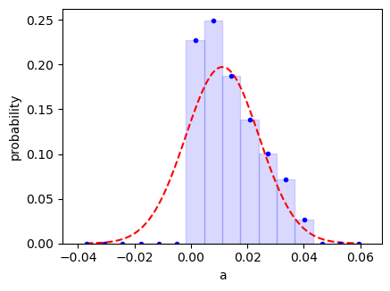

.. |GVar| replace:: :class:`gvar.GVar`
.. |nonlinear_fit| replace:: :class:`lsqfit.nonlinear_fit`
.. |BufferDict| replace:: :class:`gvar.BufferDict`
.. |~| unicode:: U+00A0
   :trim:

.. highlight:: python

.. _non-gaussian-behavior:

Non-Gaussian Behavior; Testing Fits
=====================================

Introduction
--------------------
The various analyses in the Tutorial assume implicitly that every
probability distribution relevant to a fit is Gaussian. The input
data and priors are assumed Gaussian. The ``chi**2`` function is
assumed to be well approximated by a Gaussian in the vicinity of
its minimum, in order to estimate uncertainties for the best-fit
parameters. Functions of those parameters are assumed to yield
results that are described by Gaussian random variables. These assumptions
are usually pretty good for high-statistics data, when standard deviations
are small, but can lead to problems with low statistics.

Here we present three methods for testing these assumptions.
Some of these techniques, like the *statistical bootstrap* and
Bayesian integration, can also be used to analyze non-Gaussian
results.

Bootstrap Error Analysis; Non-Gaussian Output
-------------------------------------------------
The bootstrap provides an efficient way to check on a fit's
validity, and also a method for analyzing non-Gaussian outputs.
The strategy is to:

    1.  make a large number of "bootstrap copies" of the
        original input data and prior that differ from each other
        by random amounts characteristic of the underlying randomness
        in the original data and prior (see
        the documentation for :meth:`lsqfit.nonlinear_fit.bootstrap_iter`
        for more information);

    2.  repeat the entire fit analysis for each bootstrap copy of
        the data and prior, extracting fit results from each;

    3.  use the variation of the fit results from bootstrap copy
        to bootstrap copy to determine an approximate probability
        distribution (possibly non-Gaussian) for the each result.

To illustrate, we return to our fit in the section
on :ref:`correlated-parameters`, where the uncertainties on the
final parameters were relatively large.
We will use a booststrap analysis to check the error
estimates coming out of that fit.
We do this by adding code right after the
fit, in the ``main()`` function::

    import numpy as np
    import gvar as gv
    import lsqfit

    def main():
        x, y = make_data()
        prior = make_prior()
        fit = lsqfit.nonlinear_fit(prior=prior, data=(x,y), fcn=fcn)
        print(fit)
        print('p1/p0 =', fit.p[1] / fit.p[0], 'p3/p2 =', fit.p[3] / fit.p[2])
        print('corr(p0,p1) =', gv.evalcorr(fit.p[:2])[1,0])

        # boostrap analysis: collect bootstrap data
        print('\nBootstrap Analysis:')
        Nbs = 40                # number of bootstrap copies
        output = {'p':[], 'p1/p0':[], 'p3/p2':[]}
        for bsfit in fit.bootstrap_iter(Nbs):
            p = bsfit.pmean
            output['p'].append(p)
            output['p1/p0'].append(p[1] / p[0])
            output['p3/p2'].append(p[3] / p[2])

        # average over bootstrap copies and tabulate results
        output = gv.dataset.avg_data(output, bstrap=True)
        print(gv.tabulate(output))
        print('corr(p0,p1) =', gv.evalcorr(output['p'][:2])[1,0])

    def make_data():
        x = np.array([
            4., 2., 1., 0.5, 0.25, 0.167, 0.125, 0.1, 0.0833, 0.0714, 0.0625
            ])
        y = gv.gvar([
            '0.198(14)', '0.216(15)', '0.184(23)', '0.156(44)', '0.099(49)',
            '0.142(40)', '0.108(32)', '0.065(26)', '0.044(22)', '0.041(19)',
            '0.044(16)'
            ])
        return x, y

    def make_prior():
        p = gv.gvar(['0(1)', '0(1)', '0(1)', '0(1)'])
        p[1] = 20 * p[0] + gv.gvar('0.0(1)')     # p[1] correlated with p[0]
        return p

    def fcn(x, p):
        return (p[0] * (x**2 + p[1] * x)) / (x**2 + x * p[2] + p[3])

    if __name__ == '__main__':
        main()

The ``bootstrap_iter`` produces fits ``bsfit`` for each of
``Nbs=40`` different bootstrap copies of the input data (``y`` and the prior).
We collect the mean values for the various parameters and functions of
parameters from each fit, ignoring the uncertainties, and
then calculate averages and covariance matrices from these results using
:func:`gvar.dataset.avg_data`.

Most of the bootstrap results agree with the results coming directly from
the fit:

.. literalinclude:: eg3c.out

In particular, the bootstrap analysis confirms the previous error estimates
(to within 10-30%, since ``Nbs=40``) except for ``p3/p2``, where the error
is substantially larger in the bootstrap analysis.

If ``p3/p2`` is important, one might want to look
more closely at its distribution.
We use the bootstrap to create histograms of the probability distributions
of ``p3/p2`` and ``p1/p01``
by adding the following code to the end of the ``main()``
function::

        print('Histogram Analysis:')
        count = {'p1/p0':[], 'p3/p2':[]}
        hist = {
            'p1/p0':gv.PDFHistogram(fit.p[1] / fit.p[0]),
            'p3/p2':gv.PDFHistogram(fit.p[3] / fit.p[2]),
            }

        # collect bootstrap data
        for bsfit in fit.bootstrap_iter(n=1000):
            p = bsfit.pmean
            count['p1/p0'].append(hist['p1/p0'].count(p[1] / p[0]))
            count['p3/p2'].append(hist['p3/p2'].count(p[3] / p[2]))

        # calculate averages and covariances
        count = gv.dataset.avg_data(count)

        # print histogram statistics and show plots
        import matplotlib.pyplot as plt
        pltnum = 1
        for k in count:
            print(k + ':')
            print(hist[k].analyze(count[k]).stats)
            plt.subplot(1, 2, pltnum)
            plt.xlabel(k)
            hist[k].make_plot(count[k], plot=plt)
            if pltnum == 2:
                plt.ylabel('')
            pltnum += 1
        plt.show()

Here we do 1000 bootstrap copies (rather than 40)
to improve the accuracy of the bootstrap
results. The output from this code shows statistical analyses of the
histogram data for ``p1/p0`` and ``p3/p2``:

.. literalinclude:: eg3d.out

The code also displays histograms of the probability distributions, where the
dashed lines show the results expected directly from the fit (that is,
in the Gaussian approximation):

    .. image:: eg3d.png
        :width: 100%

While the distribution for ``p1/p0`` is consistent with the fit
results (dashed line) and Gaussian,
the distribution for ``p3/p2`` is significantly skewed, with
a much longer tail to the right. The final result for ``p3/p2`` might
more accurately be summarized as 0.48 with errors of +0.31 and |~| -0.15,
although the Gaussian estimate of 0.48±0.22 would suffice for many
applications.
The skewed distribution for ``p3/p2`` is not particularly
surprising given the ±50% uncertainty in the
denominator |~| ``p2``.

Bayesian Integrals
-------------------
Bayesian expectation values provide an alternative to least-squares fits.
These expectation values are integrals over the fit parameters that are
weighted by the probability density function (PDF for the parameters)
proportional
to ``exp(-chi**2/2)``, where ``chi**2`` includes contributions from both
the data and the priors. They can be used to
calculate mean values of the parameters, their covariances, and the means
and covariances of any function of the parameters.
These will agree with the
best-fit results of our least-squares fits provided ``chi**2`` is well
approximated by its quadratic expansion in the parameters --- that is,
insofar as
``exp(-chi**2/2)`` is well approximated
by the Gaussian distribution in the parameters
specified by their best-fit means and covariance matrix (from ``fit.p``).

Here we use
:class:`lsqfit.BayesIntegrator` to evaluate Bayesian expectation values.
:class:`lsqfit.BayesIntegrator` uses the :mod:`vegas` module for adaptive
multi-dimensional integration to evaluate expectation values. It integrates
arbitrary functions of the parameters, multiplied by the probability
density function, over the entire parameter space. (Module :mod:`vegas`
must be installed for :class:`lsqfit.BayesIntegrator`.)

To illustrate :class:`lsqfit.BayesIntegrator`,
we again revisit the analysis in the section
on :ref:`correlated-parameters`. We modify the end of the ``main()`` function
of our original code
to evaluate the means and covariances of the parameters, and also
their probability histograms, using a Bayesian integral::

    import matplotlib.pyplot as plt
    import numpy as np
    import gvar as gv
    import lsqfit

    def main():
        x, y = make_data()
        prior = make_prior()
        fit = lsqfit.nonlinear_fit(prior=prior, data=(x,y), fcn=fcn)
        print(fit)

        # Bayesian integrator
        expval = lsqfit.BayesIntegrator(fit)

        # adapt integrator expval to PDF from fit
        neval = 1000
        nitn = 10
        expval(neval=neval, nitn=nitn)

        # <g(p)> gives mean and covariance matrix, and counts for histograms
        hist = [
            gv.PDFHistogram(fit.p[0]), gv.PDFHistogram(fit.p[1]),
            gv.PDFHistogram(fit.p[2]), gv.PDFHistogram(fit.p[3]),
            ]
        def g(p):
            return dict(
                mean=p,
                outer=np.outer(p, p),
                count=[
                    hist[0].count(p[0]), hist[1].count(p[1]),
                    hist[2].count(p[2]), hist[3].count(p[3]),
                    ],
                )

        # evaluate expectation value of g(p)
        results = expval(g, neval=neval, nitn=nitn, adapt=False)

        # analyze results
        print('\nIterations:')
        print(results.summary())
        print('Integration Results:')
        pmean = results['mean']
        pcov =  results['outer'] - np.outer(pmean, pmean)
        print('    mean(p) =', pmean)
        print('    cov(p) =\n', pcov)

        # create GVars from results
        p = gv.gvar(gv.mean(pmean), gv.mean(pcov))
        print('\nBayesian Parameters:')
        print(gv.tabulate(p))

        # show histograms
        print('\nHistogram Statistics:')
        count = results['count']
        for i in range(4):
            # print histogram statistics
            print('p[{}]:'.format(i))
            print(hist[i].analyze(count[i]).stats)
            # make histogram plots
            plt.subplot(2, 2, i + 1)
            plt.xlabel('p[{}]'.format(i))
            hist[i].make_plot(count[i], plot=plt)
            if i % 2 != 0:
                plt.ylabel('')
        plt.show()

    def make_data():
        x = np.array([
            4.    ,  2.    ,  1.    ,  0.5   ,  0.25  ,  0.167 ,  0.125 ,
            0.1   ,  0.0833,  0.0714,  0.0625
            ])
        y = gv.gvar([
            '0.198(14)', '0.216(15)', '0.184(23)', '0.156(44)', '0.099(49)',
            '0.142(40)', '0.108(32)', '0.065(26)', '0.044(22)', '0.041(19)',
            '0.044(16)'
            ])
        return x, y

    def make_prior():
        p = gv.gvar(['0(1)', '0(1)', '0(1)', '0(1)'])
        p[1] = 20 * p[0] + gv.gvar('0.0(1)')     # p[1] correlated with p[0]
        return p

    def fcn(x, p):
        return (p[0] * (x**2 + p[1] * x)) / (x**2 + x * p[2] + p[3])

    if __name__ == '__main__':
        main()

Here ``expval`` is an integrator that is used to evaluate expectation
values of arbitrary functions of the fit parameters.
:class:`BayesIntegrator` uses output (``fit``) from a least-squares fit to
design a :mod:`vegas` integrator
optimized for calculating expectation values.
The integrator uses an
iterative Monte Carlo algorithm that adapts to the
probability density function after each iteration.
See the :mod:`vegas` documentation for much more information.

We first call the integrator without a function. This allows it
to adapt to the probability density function from the fit without the extra
overhead of evaluating a function of the parameters. The integrator
uses ``nitn=10`` iterations of the :mod:`vegas` algorithm, with at most
``neval=1000`` evaluations of the probability density function for each
iteration.

We then use the optimized integrator to evaluate the expectation value
of function ``g(p)`` (turning adaptation off with ``adapt=False``).
The expectation value of ``g(p)`` is returned
in dictionary ``results``.

The results from this script are:

.. literalinclude:: eg3e.out

The iterations table shows results from each of the ``nitn=10``
vegas iterations used to
evaluate the expectation values. Estimates for the integral of the probability
density function are listed for each iteration. (Results from the integrator
are approximate, with error estimates.) These are consistent with each other
and with the (more accurate) overall average.

The integration results show that the Bayesian estimates for the means
of the parameters are accurate to roughly 1% or better, which is
sufficiently accurate here given the size of the standard deviations.
Estimates for
the covariance matrix elements are less accurate, which is typical.
This information is converted into |GVar|\s for the parameters and
tabulated under "Bayesian Parameters," for comparison with the
original fit results --- the agreement is pretty good.
This is further confirmed by the
(posterior) probability distributions
for each parameter:

The means are shifted slightly from the fit results and there
is modest skewing, but the differences are not great.

As a second example of Bayesian integration, we return briefly to
the problem described in :ref:`positive-parameters`: we want the
average ``a`` of noisy data subject the constraint that the average
must be positive. The constraint is likely to
introduce strong distortions in the probability density function (PDF)
given that the fit analysis suggests a value of 0.011±0.013.
We plot the actual PDF using the following code, beginning with
a fit that uses a flat prior (between 0 and |~| 0.04)::

    import gvar as gv
    import lsqfit

    # data, prior, and fit function
    y = gv.gvar([
       '-0.17(20)', '-0.03(20)', '-0.39(20)', '0.10(20)', '-0.03(20)',
       '0.06(20)', '-0.23(20)', '-0.23(20)', '-0.15(20)', '-0.01(20)',
       '-0.12(20)', '0.05(20)', '-0.09(20)', '-0.36(20)', '0.09(20)',
       '-0.07(20)', '-0.31(20)', '0.12(20)', '0.11(20)', '0.13(20)'
       ])

    prior = {}
    prior['erfinv(50*a-1)'] = gv.gvar('0(1)') / gv.sqrt(2)

    def fcn(p, N=len(y)):
       a = (1 + p['50*a-1']) / 50.
       return N * [a]

    # least-squares fit
    fit = lsqfit.nonlinear_fit(prior=prior, data=y, fcn=fcn, extend=True)
    print(fit)
    a = (1 + fit.p['50*a-1']) / 50
    print('a =', a)

    # Bayesian analysis: histogram for a
    hist = gv.PDFHistogram(a, nbin=16, binwidth=0.5)

    def g(p):
        a = (1 + p['50*a-1']) / 50
        return hist.count(a)

    expval = lsqfit.BayesIntegrator(fit)
    expval(neval=1009, nitn=10)
    count = expval(g, neval=1000, nitn=10, adapt=False)

    # print out results and show plot
    print('\nHistogram Analysis:')
    print (hist.analyze(count).stats)

    hist.make_plot(count, show=True)

The output from this script is

.. literalinclude:: eg6-hist.out

and the probability distribution for ``a`` looks like

This distribution is distorted between ``a=0`` and the mean
value, but otherwise is fairly similar to the Gaussian result
0.11±0.13 (dashed line). A more accurate summary of the result
for ``a`` would be 0.12 with an error of +0.14 and -0.09, though
again the Gaussian result is not terribly misleading even in this
case.

The Bayesian integrals are relatively simple in these example. More
complicated problems can require much more computer time to evaluate
the integrals, with hundreds of thousands or millions of integrand
evaluations per iteration (``neval``). This is particularly true
as the number of parameters increases. :class:`BayesIntegrator` uses
information from the least-squares fit to simplify the integration
for :mod:`vegas` by optimizing the integration variables used, but
integrals over tens of variables are intrinsically challenging.
:class:`BayesIntegrator` can be used with MPI to run such integrals
on multiple processors, for a considerable speed-up.

We used Bayesian integrals here to deal with non-Gaussian behavior in
fit outputs. The case study :ref:`outliers` shows how to use them
when the input data is not quite Gaussian.

Testing Fits with Simulated Data
--------------------------------
Ideally we would test a fitting protocol by doing fits of data similar to
our actual fit but where we know the correct values for the fit parameters
ahead of the fit. Method
:meth:`lsqfit.nonlinear_fit.simulated_fit_iter`` returns an iterator that
creates any number of such simulations of the original fit.

A key assumption underlying least-squares fitting is that the fit
data ``y[i]`` are random samples from a distribution whose mean
is the fit function ``fcn(x, fitp)`` evaluated with the best-fit
values ``fitp`` for the parameters. ``simulated_fit_iter`` iterators
generate simulated data by drawing other random samples from the
same distribution, assigning them the same covariance matrix as the
original data. The simulated data are fit
using the same priors and fitter settings
as in the original fit, and the results (an :class:`lsqfit.nonlinear_fit`
object) are returned by the iterator. Fit results from simulated
data should agree, within errors, with the original fit results since the
simulated data are from the same distribution as the original data. There
is a problem with the fitting protocol if this is not the case most of the
time.

To illustrate we again examine the fits
in the section on :ref:`correlated-parameters`:
we add three fit simulations at the end of the ``main()`` function::

    import numpy as np
    import gvar as gv
    import lsqfit

    def main():
        x, y = make_data()
        prior = make_prior()
        fit = lsqfit.nonlinear_fit(prior=prior, data=(x,y), fcn=fcn)
        print(40 * '*' + ' real fit')
        print(fit.format(True))

        # 3 simulated fits
        for sfit in fit.simulated_fit_iter(n=3):
            # print simulated fit details
            print(40 * '=' + ' simulation')
            print(sfit.format(True))

            # compare simulated fit results with exact values (pexact=fit.pmean)
            diff = sfit.p - sfit.pexact
            print('\nsfit.p - pexact =', diff)
            print(gv.fmt_chi2(gv.chi2(diff)))
            print

    def make_data():
        x = np.array([
            4.    ,  2.    ,  1.    ,  0.5   ,  0.25  ,  0.167 ,  0.125 ,
            0.1   ,  0.0833,  0.0714,  0.0625
            ])
        y = gv.gvar([
            '0.198(14)', '0.216(15)', '0.184(23)', '0.156(44)', '0.099(49)',
            '0.142(40)', '0.108(32)', '0.065(26)', '0.044(22)', '0.041(19)',
            '0.044(16)'
            ])
        return x, y

    def make_prior():
        p = gv.gvar(['0(1)', '0(1)', '0(1)', '0(1)'])
        p[1] = 20 * p[0] + gv.gvar('0.0(1)')        # p[1] correlated with p[0]
        return p

    def fcn(x, p):
        return (p[0] * (x**2 + p[1] * x)) / (x**2 + x * p[2] + p[3])

    if __name__ == '__main__':
        main()

This code produces the following output, showing how the input data
fluctuate from simulation to simulation:

.. literalinclude:: eg3f.out

The parameters ``sfit.p`` produced by the simulated fits agree well
with the original fit parameters ``pexact=fit.pmean``, with good
fits in each case. We calculate the ``chi**2`` for the difference
``sfit.p - pexact`` in
each case; good ``chi**2`` values validate the parameter values, standard
deviations, and correlations.
